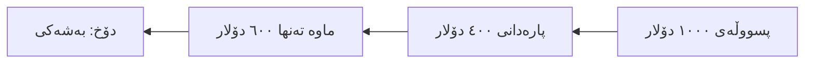

# سیناریۆکانی پێشکەوتووی پارەدان: مامەڵەکردن لەگەڵ جووڵەی پارەی ڕاستەقینە

ئەم ڕێبەرە ڕوونی دەکاتەوە چۆن مامەڵە لەگەڵ دۆخە ئاڵۆزەکانی پارەدان بکەیت وەک پارەدانی بەشەکی، زیادە پارەدان، و پێشوەخت پارەدان. ئایا کڕیارێک زوو پارە دەدات، یان زیاتر دەدات، یان بە قیست دەدات، ئێمە باسی دەکەین.

---

## سیناریۆکانی پێشکەوتووی پارەدان چین؟

لە جیهانی ڕاستەقینەدا، پارەدانەکان هەمیشە بە تەواوی لەگەڵ پسووڵەکان یەکناگرنەوە.
- **پارەدانی بەشەکی (Partial Payments)**: دانی بڕە پارەیەکی گەورە بە شێوەی بەش بەش.
- **زیادە پارەدان (Overpayments)**: ناردنی پارەی زیاتر لەوەی لە پسووڵەکەدا دیاری کراوە.
- **پێشوەخت پارەدان (Prepayments)**: پارەدان پێش ئەوەی پسووڵەکە دروست بکرێت.

تێگەیشتن لەم سیناریۆیانە یارمەتیت دەدات تۆمارەکانت بە وردی ڕابگریت و کڕیارەکانت دڵخۆش بن.

---

## پارەدانی بەشەکی (Partial Payments)

**پارەدانی بەشەکی** کاتێک ڕوودەدات کە کڕیار بڕێک پارە دەدات کە کەمترە لە کۆی گشتی پسووڵەکە. سیستمەکە چاودێری ئەوە دەکات کە چی دراوە و چی ماوەتەوە.

### ڕەوتی کار

ئەمە چۆنیەتی ڕۆیشتنی پارەدانی بەشەکییە لە سیستمەکەدا:

### تێگەیشتن لە دۆخەکان

سیستمەکە دۆخەکان بەکاردەهێنێت بۆ ئەوەی پێتبڵێت پسووڵەکە لە چی قۆناغێکدایە:

| دۆخ | واتاکەی |
|--------|---------|
| **کراوە (Open)** | هیچ پارەیەک نەدراوە. تەواوی بڕەکە ماوە. |
| **بەشەکی (Partial)** | بڕێک پارە وەرگیراوە، بەڵام هێشتا ماوە بدریت. |
| **دراوە (Paid)** | بە تەواوی دراوە. باڵانس ٠یە. |

### نموونە

1. تۆ پسووڵەیەک بۆ **١,٠٠٠ دۆلار** دەنێریت.
2. کڕیار **٤٠٠ دۆلار** دەدات.
3. تۆ پارەدانی ٤٠٠ دۆلار تۆمار دەکەیت بۆ پسووڵەکە.
4. دۆخی پسووڵەکە دەگۆڕێت بۆ **بەشەکی**.
5. **بڕی ماوە** دەبێتە **٦٠٠ دۆلار**.
6. دواتر، کڕیارەکە **٦٠٠ دۆلار**ە ماوەکە دەدات.
7. تۆ پارەدانی دووەم تۆمار دەکەیت.
8. دۆخی پسووڵەکە دەگۆڕێت بۆ **دراوە (Paid)**.

---

## زیادە پارەدان (Overpayments)

**زیادە پارەدان** کاتێک ڕوودەدات کە کڕیار بڕێک پارە دەدات کە زیاترە لەوەی قەرزدارە. ئەمە "بڕی متمانە (Credit)" لەسەر هەژمارەکەیان دروست دەکات کە دەتوانرێت دواتر بەکاربێت.

### سیناریۆ

> **سیناریۆ**: تۆ پسووڵەیەک بۆ **١,٠٠٠ دۆلار** دەنێریت. کڕیار بە هەڵە چەکێک بە **١,٢٠٠ دۆلار** دەنووسێت.

### چی بکەیت

دوو هەڵبژاردەی سەرەکی هەیە:

1.  **وەک قەرز هەڵیبگرە**: تەواوی ١,٢٠٠ دۆلارەکە تۆمار بکە. ئەو ٢٠٠ دۆلارە زیادەیە وەک قەرز (Credit) لەسەر هەژمارەکەی دەمێنێتەوە. جارێکی تر کە پسووڵەی بۆ دەکەیت، سیستمەکە لێت دەپرسێت ئایا دەتەوێت ئەم قەرزە بەکاربهێنیت.
2.  **گەڕاندنەوە (Refund)**: جیاوازی ٢٠٠ دۆلارەکە بۆ کڕیارەکە بگەڕێنەوە.

### سیستەم چۆن مامەڵەی لەگەڵ دەکات

کاتێک پارەدانێک پشتڕاست دەکەیتەوە کە گەورەترە لە پسووڵەکە:
1. پسووڵەکە وەک **دراوە (Paid)** دیاری دەکرێت.
2. بڕە زیادەکە وەک **قەرزی کراوە** بۆ ئەو هاوبەشە تۆمار دەکرێت.
3. دەتوانیت ئەمە لە پەرتووکی هاوبەشدا ببینیت و عادەتەن لە کاتی دروستکردنی پسووڵەی داهاتوودا دەردەکەوێت وەک هەڵبژاردەیەک.

---

## پێشوەخت پارەدان (Prepayments)

**پێشوەخت پارەدان** بریتییە لە وەرگرتنی پارە *پێش* ئەوەی پسووڵە دروست بکرێت. ئەمە باوە بۆ پێشەکی (deposits) یان داواکاری تایبەت.

### حاڵەتی بەکارهێنان

> **حاڵەت**: کڕیارێک دەیەوێت کەلوپەلی تایبەت داوا بکات. تۆ پێویستت بە **٥٠٪ پێشەکی** هەیە پێش دەستکردن بە کار.

### چۆن تۆماری بکەیت

1.  بڕۆ بۆ **ژمێریاری ← کڕیارەکان ← پارەدانەکان**.
2.  پارەدانێکی نوێ دروست بکە بۆ بڕی وەرگیراو (بۆ نموونە ٥٠٠ دۆلار).
3.  بە پسووڵەوە **مەیبەستەرەوە** (خانەی پسووڵە بە  بەتاڵی بهێڵەرەوە).
4.  ناوی **هاوبەشەکە** دیاری بکە.
5.  کلیک لەسەر **پشتڕاستکردنەوە** بکە.

دواتر، کاتێک پسووڵەی کۆتایی دروست دەکەیت:
1. سیستمەکە پارەدانە بوونی هەیە دەدۆزێتەوە بۆ ئەو هاوبەشە.
2. داوات لێ دەکات کە ئایا دەتەوێت ئەم قەرزە **زیاد بکەیت** بۆ پسووڵە نوێیەکە.
3. کلیککردن لەسەر "زیادکردن" پێشوەخت پارەدانەکە بەکاردەهێنێت بۆ کەمکردنەوەی بڕی پسووڵەکە.

> [!TIP]
> ئەمە تەواو وەک "باڵانسی کردنەوە" وایە—پارەیەکە تۆ هەڵیدەگریت بۆ کڕیارەکە تاوەکو لە پسووڵەیەکی گونجاودا بەکاردەهێنرێت.

---

## پارەدانی فرە-دراو (Multi-Currency)

مامەڵە لەگەڵ کڕیاری نێودەوڵەتی دەکەیت؟ دەتوانیت پارە بە دراوێک وەربگریت کە جیاوازە لە دراوی پسووڵەکە.

- **پسووڵە**: دەرچووە بە **دۆلار ($)**.
- **پارەدان**: وەرگیراوە بە **یۆرۆ (€)**.

**چەمکە سەرەکییەکان**:
- **نرخی ئاڵوگۆڕ**: سیستمەکە نرخی ڕۆژی *پارەدان* بەکاردەهێنێت.
- **قازانج/زیان**: ئەگەر نرخەکە لە نێوان ڕۆژی پسووڵە و ڕۆژی پارەدان گۆڕابێت، جیاوازیەکە بە ئۆتۆماتیکی لە هەژماری **قازانج/زیانی ئاڵوگۆڕ** تۆمار دەکرێت.

---

## باشترین پراکتیزەکان

### 🔄 هاوتاکردن (Reconciliation)
- **پشکنینی پەرتووکی هاوبەش**: بە بەردەوامی باڵانسی هاوبەشەکان بپشکنە بۆ دڵنیابوون لەوەی قەرزەکان بەکارهێنراون یان گەڕێنراونەتەوە.
- **پاککردنەوەی قەرزە کۆنەکان**: مەهێڵە زیادە پارەدانی بچووک بۆ هەمیشە بمێننەوە. بەکاریان بهێنە بۆ پسووڵەی نوێ یان پێویست نەبوون پاکیان بکەرەوە.

### 📝 پەیوەندی ڕوون
- **کەشف** بۆ کڕیارەکان بنێرە بۆ ئەوەی ئاگاداری باڵانسی ماوە بن (بۆ بەشەکی) یان قەرزی بەردەست (بۆ زیادە/پێشوەخت).

---

## چارەسەرکردنی کێشەکان

### "پسووڵەکەم هێشتا وەک نەدراو دەردەکەوێت دوای پارەدان؟"
- ئایا پارەدانەکەت **پشتڕاست** (Confirm) کردەوە؟ پارەدانی ڕەشنووس باڵانس کەم ناکاتەوە.
- ئایا بۆ **پسووڵەی هەڵە** بەکارت هێنا؟ سەیری وردەکاریی تۆماری پارەدانەکە بکە.

### "چۆن دەتوانم زیادە پارەدانێک بگەڕێنمەوە؟"
- بڕۆ بۆ **ژمێریاری ← کڕیارەکان ← پارەدانەکان**.
- پارەدانێکی نوێ دروست بکە بە **جۆری پارەدان: ناردنی پارە** (گەڕاندنەوە).
- بیبەستەرەوە بە پارەدانە ئەسڵیەکە یان قەرزی هاوبەشەکە.

### "قەرزی پێشوەخت پارەدانەکەم لە کوێیە؟"
- سەیری ڕاپۆرتی **پەرتووکی هاوبەش** بکە.
- دڵنیابە پێشوەخت پارەدانەکە **پشتڕاست کراوەتەوە** و تۆماری ڕۆژانەی هەیە.
- دڵنیابە کە هی هاوبەشە ڕاستەکەیە.
