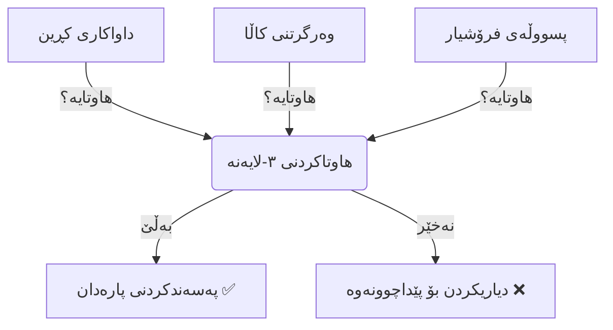

# تێگەیشتن لە داواکاری کڕین (Purchase Orders)

تێگەیشتن لە داواکاری کڕین (Purchase Orders)
ئەم ڕێبەرە ڕوونی دەکاتەوە چۆن داواکاری کڕین (POs) بەکاربهێنیت بۆ کڕینی کاڵا و خزمەتگوزاری بۆ کارەکەت. جا بەڕێوەبەری دابینکردن بیت یان خاوەن کار، ئەم ڕێبەرە یارمەتیت دەدات خەرجییەکانت بەڕێوە ببەیت و دڵنیابیت لەوەی ئەوەی پارەی دەدەیت ئەوە وەردەگریت.

---

## داواکاری کڕین (Purchase Order) چییە؟

وەک گرێبەستێکی فەرمی لە نێوان تۆ و فرۆشیارەکەت سەیری **داواکاری کڕین** بکە. تەنها لیستی بازاڕکردن نییە؛ بەڵکو بەڵێنێکە کە دەڵێت: *"ئەگەر ئەم کاڵایانەم بۆ بنێریت بەم نرخە، من بەڵێن دەدەم پارەکەت بدەمێ."*

**بۆچی داواکاری کڕین بەکاربهێنین لە جیاتی ئەوەی تەنها تەلەفۆن بۆ فرۆشیار بکەین؟**
1.  **پاراستنی یاسایی**: وەک بەڵگەیەک کاردەکات لەسەر ئەوەی ڕێککەوتنی لەسەر کراوە (نرخ، بڕ، ڕێکەوتی گەیاندن).
2.  **كۆنتڕۆڵی بودجە**: دەتوانیت پەسەندی خەرجییەکان بکەیت *پێش* ئەوەی پارە لە بانک دەربچێت.
3.  **دیقەت و وردبینی**: دڵنیایی دەدات کە تیمی کۆگا دەزانن چاوەڕێی چی بکەن.

> **💡 نموونە**: ئەگەر **پێشنیاری نرخ (Sales Quote)** ئەو لیستە (مێنیو) بێت کە دەیدەیت بە کڕیار، ئەوا **داواکاری کڕین (Purchase Order)** ئەو داواکارییەیە کە دەیدەیت بە چێشتلێنەرەکە.

---

## ڕێڕەوی کارکردنی دابینکردن (Procurement Workflow)

لە سیستەمی Kezi ERP، کڕینی شتەکان ڕێڕەوێکی ژیرانە پەیڕەو دەکات بۆ ئەوەی هەموو شتێک بە ڕێکخراوی بمێنێتەوە.

### 1. داواکاری نرخ (RFQ) 📝
پێش ئەوەی بکڕیت، ڕەنگە بتەوێت نرخەکان بەراورد بکەیت. تۆ **RFQ** دروست دەکەیت و دەینێریت بۆ یەک یان زیاتر لە فرۆشیارەکان بۆ ئەوەی بپرسی: *"نرخی ١٠٠ لاپتۆپ چەندە؟"*
*   **دۆخ**: ڕەشنووس / نێردراو
*   **کردار**: ئەو بەرهەمانە داخڵ دەکەیت کە دەتەوێت.

### 2. داواکاری کڕینی پشتڕاستکراوە ✅
کاتێک لەسەر نرخ ڕێککەوتن، RFQ ـەکە پشتڕاست دەکەیتەوە. ئێستا دەبێتە **داواکاری کڕین (Purchase Order)**.
*   **دۆخ**: داواکاری کڕین
*   **کردار**: سیستەمەکە نرخ و بڕەکان دادەخات (Lock) بۆ ئەوەی بە هەڵە گۆڕانکارییان تێدا نەکرێت.

### 3. وەرگرتنی بەرهەمەکان 📦
کاتێک بارەکە دەگات، تیمی کۆگاکەت کاڵاکان پشکنین دەکەن لە بەرامبەر داواکاری کڕینەکە.
*   **کردار**: دروستکردنی **پسووڵەی وەرگرتن (Receipt)**.
*   **ئەنجام**: بڕی کۆگاکەت زیاد دەکات.

### 4. پسووڵەی فرۆشیار (Vendor Bill) 🧾
فرۆشیارەکە پسووڵەیەک (Bill) ـت بۆ دەنێرێت بۆ پارەدان.
*   **کردار**: دروستکردنی **پسووڵەی کڕین (Bill)** کە بەستراوەتەوە بە داواکاری کڕینەکە.
*   **ئەنجام**: تۆ پارەی فرۆشیارەکە دەدەیت.

---

## سیحری هاوتاکردنی سێ-لایەنە (3-Way Matching)

یەکێک لە بەهێزترین تایبەتمەندییەکانی بەکارهێنانی داواکاری کڕین بریتییە لە **هاوتاکردنی سێ-لایەنە**. ئەمە ڕێگری دەکات لە ساختەکاری و هەڵە.

**چەمکەکە:**
سیستەمەکە پشکنین دەکات کە ئەم سێ بەڵگەنامەیە بە تەواوی هاوتا بن:

1.  **داواکاری کڕینەکە**: ئەوەی تۆ *داوات کردووە* (بۆ نموونە، ١٠ کورسی بە ٥٠ دۆلار).
2.  **پسووڵەی وەرگرتن**: ئەوەی تۆ *وەرتگرتووە* (بۆ نموونە، ١٠ کورسی).
3.  **پسووڵەی فرۆشیار**: ئەوەی داوات لێدەکرێت *پارەی بدەیت* (بۆ نموونە، ٥٠٠ دۆلار).

**ئەگەر هاوتا بوون**: پارەی پسووڵەکە دەدەیت.
**ئەگەر هاوتا نەبوون**: سیستەمەکە ئاگادارت دەکاتەوە (بۆ نموونە، ئەگەر پسووڵەکە بۆ ١٢ کورسی بێت بەڵام تۆ تەنها ١٠ ت وەرگرتبێت).

---

## چۆنیەتی دروستکردنی داواکاری کڕین

### هەنگاوی ١: دەستپێکردنی RFQ
بڕۆ بۆ: **کڕین → داواکاری نرخ (RFQ) → دروستکردن**

1.  **فرۆشیار**: هەڵبژێرە لە کێ دەکڕیت.
2.  **ڕێکەوتی داواکاری**: ڕێکەوتی ئەمڕۆ (خۆکارانە).
3.  **هێڵەکانی بەرهەم**: ئەو کاڵایانە زیاد بکە کە پێویستتە.

### هەنگاوی ٢: ناردن بۆ فرۆشیار (بژاردە)
دەتوانیت RFQ ـەکە ڕاستەوخۆ لە سیستەمەکەوە ئیمەیڵ بکەیت بۆ داواکردنی پشتڕاستکردنەوە.

### هەنگاوی ٣: پشتڕاستکردنەوەی داواکاری
کرتە لەسەر **پشتڕاستکردنەوەی داواکاری** بکە.
*   دۆخەکە دەگۆڕێت لە **RFQ** بۆ **داواکاری کڕین**.
*   گواستنەوەی **وەرگرتن (Receipt)** خۆکارانە دروست دەکرێت بۆ ئەوەی کۆگاکەت چاوەڕێی کاڵاکان بن.

### هەنگاوی ٤: وەرگرتنی کاڵاکان
کاتێک کاڵاکان گەیشتن، کرتە لەسەر دوگمەی **وەرگرتنی بەرهەمەکان** بکە. پشتڕاستی بکەرەوە کە بڕی ڕاستت وەرگرتووە.

### هەنگاوی ٥: دروستکردنی پسووڵە
کاتێک پسووڵەکەت لە فرۆشیارەوە پێگەیشت، کرتە لەسەر **دروستکردنی پسووڵە (Create Bill)** بکە لەسەر داواکاری کڕینەکە. سیستەمەکە خۆکارانە هێڵەکان پڕ دەکاتەوە بەپێی ئەوەی داوات کردووە/وەرتگرتووە.

---

## چارەسەرکردنی کێشەکان

### پرسیار: بۆچی داواکاری کڕینەکەم داخراوە (Locked)؟
**وەڵام:** کاتێک داواکارییەک **پشتڕاستکرایەوە**، دادەخرێت بۆ ڕێگریکردن لە گۆڕانکاری کە ببێتە هۆی ناهەماهەنگی لەگەڵ وەرگرتنی کۆگا. ئەگەر پێویستە بیگۆڕیت:
1.  **کرانەوە (Unlock)** ی داواکارییەکە بکە (ئەگەر مۆڵەتت هەبێت).
2.  یان، **هەڵوەشاندنەوە (Cancel)** ی بکە و دانەیەکی نوێ دروست بکە.

### پرسیار: چۆن داواکارییەک هەڵبوەشێنمەوە؟
**وەڵام:** ئەگەر داواکارییەکە هێشتا وەرنەگیراوە، کرتە لەسەر **هەڵوەشاندنەوە** بکە. ئەگەر پێشتر کاڵاکانت وەرگرتووە، سەرەتا دەبێت کاڵاکان بگەڕێنیتەوە (Inventory Return) پێش ئەوەی بتوانیت داواکارییەکە هەڵبوەشێنیتەوە.

### پرسیار: ئایا دەتوانم بەرهەمەکان بە بەشی جیاواز وەربگرم؟
**وەڵام:** بەڵێ! ئەگەر ١٠٠ دانەت داواکردبێت بەڵام تەنها ٥٠ گەیشتبن، وەرگرتنەکە بۆ ٥٠ دانە پەسەند بکە. سیستەمەکە *Backorder* دروست دەکات بۆ ٥٠ ـەکەی دەمێنێتەوە.

---

## باشترین پراکتیزەکان

*   **هەمیشە پشتڕاستی بکەرەوە**: داواکارییەکان لە دۆخی RFQ جێ مەهێڵە ئەگەر چاوەڕێی گەیاندن دەکەیت. کۆگا نازانێت کە دێت!
*   **پشکنینی پسووڵەکان**: هەمیشە پسووڵەکان *لە ڕێگەی* داواکاری کڕینەکەوە دروست بکە، نەک لە سەرەتاوە. ئەمە بەیەکەوە دەیانبەستێتەوە بۆ هاوتاکردنی ٣-لایەنە.
*   **چاودێری ڕێکەوتەکان**: ڕێکەوتی "چاوەڕوانکراوی گەیشتن" دیاری بکە بۆ ئەوەی تیمەکەت بزانن کەی شوێن لە کۆگادا ئامادە بکەن.

---

## بەڵگەنامە پەیوەندیدارەکان

- [پسووڵەی کڕین (Vendor Bills)](vendor-bills.md) - چۆنیەتی پارەدان بۆ داواکارییەکانت
- [تێگەیشتن لە کۆگا](understanding-inventory-ins-and-outs.md) - چۆنیەتی جووڵەی کاڵا
- [گواستنەوەی کۆگا](stock-movements.md) - جووڵەی ناوخۆیی کاڵا
