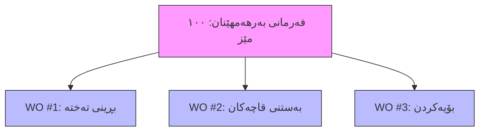

# تێگەیشتن لە فەرمانەکانی کار: هەنگاوەکانی بەرهەمهێنانی تۆ

ئەم ڕێبەرە ڕوونی دەکاتەوە فەرمانەکانی کار چین و چۆن لەگەڵ پرۆسەی بەرهەمهێنانت دەگونجێن. جا بەڕێوەبەری بەرهەمهێنان بیت یان کارمەندی ناو کارگە، ئەم ڕێبەرە یارمەیت دەدات چاودێری کارەکەت بکەیت.

---

## فەرمانی کار (Work Order) چییە؟

وەک ئەوە سەیری **فەرمانی بەرهەمهێنان (Manufacturing Order)** بکە کە ڕەچەتەیەکی تەواوە (نموونە: "دروستکردنی کێک"). **فەرمانی کار (Work Order)** هەنگاوێکی تاکە لەو ڕەچەتەیە (نموونە: "تێکەڵکردنی پێکهاتەکان"، "برژاندن لە فڕن"، "ڕازاندنەوە").

کاتێک فەرمانی بەرهەمهێنان پشتڕاست دەکەیتەوە، سیستەمەکە دابەشی دەکات بۆ فەرمانی کاری تاک. هەر فەرمانێکی کار کردارێکی دیاریکراوە کە دەبێت لە ناوەندێکی کاری دیاریکراو ئەنجام بدرێت.

**بۆچی ئەمە گرنگە؟**
1.  **کۆنترۆڵی ورد**: چاودێریکردنی پێشکەوتن هەنگاو بە هەنگاو.
2.  **بەڕێوەبردنی سەرچاوە**: خشتەکاری بۆ ئامێر یان وێستگەی دیاریکراو (ناوەندەکانی کار).
3.  **وردبینی تێچوو**: چاودێریکردنی کاتی ڕاستەقینەی بەسەرچوو بۆ هەر کردارێک بۆ هەژمارکردنی وردی تێچووی دەستی کار و سەربار.

---

## پەیوەندی بە فەرمانەکانی بەرهەمهێنان

فەرمانی بەرهەمهێنان (MO) بەڵگەنامەی دایکە. پێت دەڵێت *چی* دروست بکەیت و *کەی*. فەرمانەکانی کار (WO) منداڵەکانن؛ پێت دەڵێن *چۆن* دروستی بکەیت، هەنگاو بە هەنگاو.



- **یەک فەرمانی بەرهەمهێنان** دەبێتە هۆی دروستبوونی **چەندین فەرمانی کار**.
- دەبێت بە ئاسایی فەرمانەکانی کار بە زنجیرە تەواو بکەیت (هەنگاو ١ ← هەنگاو ٢ ← هەنگاو ٣).

---

## سوڕی ژیانی فەرمانی کار

فەرمانی کار بە سوڕێکی ژیانی دیاریکراودا تێدەپەڕێت کاتێک بە ناو کارگەکەتدا دەڕوات:

```
Pending ──▶ Ready ──▶ In Progress ──▶ Done
   ⏳         ✅           ⚙️           🎉
```

### ⏳ Pending (لەکاتی چاوەڕوانی)
- فەرمانی کار دروستکراوە بەڵام هێشتا ناتوانێت دەست پێ بکات.
- بەزۆری چاوەڕێی هەنگاوێکی پێشوو دەکات تەواو بێت (نموونە: ناتوانیت "بۆیە" بکەیت پێش ئەوەی "پێکەوەی ببەستیت").

### ✅ Ready (ئامادە)
- هەموو مەرجەکان جێبەجێ کراون.
- کەرەستەی خاو بەردەستە (ئەگەر هەبێت).
- ناوەندی کار ئامادەیە بۆ وەرگرتنی ئەم کارە.

### ⚙️ In Progress (لە کارکردن)
- کار دەستی پێکردووە.
- تایمەر ئیش دەکات (چاودێری ماوەی ڕاستەقینە دەکات).
- پێکهاتەکان بەکاردەهێنرێن.

### 🎉 Done (تەواو)
- کردارەکە تەواو بووە.
- دەرچوو (Output) ئامادەیە بۆ هەنگاوی دواتر یان کۆگاکردنی کۆتایی.
- تێچووی ڕاستەقینە تۆمار کراوە.

> [!NOTE]
> دەتوانیت فەرمانی کار **Cancel** بکەیت ئەگەر فەرمانی بەرهەمهێنان ڕەتکرایەوە یان پلانی بەرهەمهێنان گۆڕا.

---

## تەرخانکردن بۆ ناوەندەکانی کار

هەر فەرمانێکی کار تەرخان دەکرێت بۆ **ناوەندێکی کار**. ئەمە شوێن یان ئامێری دیاریکراوە کە کارەکەی تێدا ئەنجام دەدرێت (نموونە: "هێڵی کۆکردنەوە ١"، "دریل پرێس A").

- **پلاندانانی توانا**: سیستەمەکە خشتەی فەرمانەکانی کار دادەنێت بەپێی بەردەستبوونی ناوەندی کار.
- **تێچوو**: تێچووی فەرمانی کار زۆرجار هەژمار دەکرێت بەپێی نرخی کاتژمێری ناوەندی کار.

> [!TIP]
> سەیری ڕێبەری [تێگەیشتن لە ناوەندەکانی کار](understanding-work-centers.md) بکە بۆ وردەکاری زیاتر.

---

## تۆماری کات

وردبینی کلیلی تێچووە. هەر فەرمانێکی کار دوو جۆر کات تۆمار دەکات:

| جۆری کات | وەسف | بۆچی گرنگە |
|-----------|-------------|----------------|
| **ماوەی پلان بۆ دانراو** | چەند *پێشبینی* دەکەین بخایەنێت. لە لیستی کەرەستەکانەوە (BOM). | بەکاردێت بۆ خشتەکاری و تێچووی خەمڵێنراو. |
| **ماوەی ڕاستەقینە** | چەندی *بە ڕاستی* خایاند. لەلایەن کارمەندەوە تۆمار دەکرێت. | بەکاردێت بۆ تێچووی ڕاستەقینە و ڕاپۆرتی کارایی. |

**چۆن کات تۆمار بکەیت:**
1.  کلیک لەسەر **Start** بکە کاتێک دەست بە کار دەکەیت.
2.  کلیک لەسەر **Pause** بکە ئەگەر پشوو دەدەیت یان شەفت تەواو دەبێت.
3.  کلیک لەسەر **Done** بکە کاتێک ئەرکەکە تەواو بوو.

سیستەمەکە بە ئۆتۆماتیکی `ماوەی ڕاستەقینە` هەژمار دەکات.

---

## بەکارهێنانی پێکهاتە

هەندێک فەرمانی کار پێکهاتەی دیاریکراو بەکاردەهێنن. بۆ نموونە، هەنگاوی "بەستن" ڕەنگە "برغوو" و "تەختە" بەکاربهێنێت.

- **بەکارهێنانی دەستی**: تۆ بە وردی تۆماری دەکەیت چی بەکارهاتووە.
- **Backflushing**: سیستەمەکە بە ئۆتۆماتیکی بڕی چاوەڕوانکراو "بەکاردەهێنێت" کاتێک کلیک لەسەر Done دەکەیت.

دڵنیابە لە تۆمارکردنی وردی بەکارهێنان بۆ ڕاستڕاگرتنی ئاستی کۆگا.

---

## باشترین پراکتیزەکان

### 📅 زنجیرە گرنگە
- پەیڕەوی ئەو زنجیرەیە بکە کە لە فەرمانی بەرهەمهێنان دیاری کراوە. بازدان بەسەر هەنگاوەکان دەبێتە هۆی کێشەی جۆرایەتی یان سەرلێشێوان.

### ⏱️ ڕاستگۆ بە لە کات
- کاتی دەستپێک و کۆتایی ڕاستەقینە تۆمار بکە. ئەگەر کارێک کاتی زیاتری ویست، دەبێت بزانین بۆچی (ئامێر شکاوە؟ کەرەستەی خراپ؟) بۆ باشترکردنی پلاندانانی داهاتوو.

### 🧹 ناوەندەکانی کار بە پاکی ڕابگرە
- فەرمانی کار وەک "Done" دیاری بکە تەنها کاتێک کاڵا فیزیاییەکە گوازرایەوە بۆ وێستگەی دواتر. ئەمە خشتەکە بە وردی دەهێڵێتەوە.

---

## بابەتە پەیوەندیدارەکان

- [چەمکەکانی بەرهەمهێنان](manufacturing-concepts.md)
- [تێگەیشتن لە ناوەندەکانی کار (Work Centers)](understanding-work-centers.md)
- [فەرمانەکانی بەرهەمهێنان](../how-to/manufacturing-orders.md)
