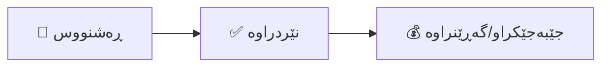

# پسوولەی وەرگرتنەوە: مامەڵەکردن لەگەڵ گەڕاندنەوەی فرۆشیار و راستکردنەوەکان

ئەم ڕێبەرە ڕوونی دەکاتەوە چۆن **پسوولەی وەرگرتنەوە** (Debit Note) بەکاربهێنیت بۆ کەمکردنەوەی ئەو پارەیەی کە قەرزداریت بە فرۆشیارێک (دابینکەر). جا چ مامەڵە لەگەڵ گەڕاندنەوەی کاڵا بێت، یان زیاد هەژمارکردن، یان گەڕاندنەوەی پارە، پسوولەی وەرگرتنەوە دڵنیایی دەدات کە قەرزەکانت و خەرجییەکانت وردن.

---

## پسوولەی وەرگرتنەوە چییە؟

**پسوولەی وەرگرتنەوە** بەڵگەنامەیەکە کە بڕی پارەی قەرزداری تۆ بۆ فرۆشیارێک کەم دەکاتەوە. ئەمە پێچەوانەی پسووڵەی کڕینە—لە جیاتی ئەوەی پارە قەرزدار بیت، تۆ داوای کەمکردنەوەی قەرزەکەت دەکەیت.

**هۆکارە باوەکان بۆ دەرکردنی پسوولەی وەرگرتنەوە:**

| هۆکار | نموونە |
|-------|--------|
| **گەڕاندنەوەی فرۆشیار** | تۆ ٥ هارد درایڤی تێکچوو دەگەڕێنیتەوە بۆ دابینکەر |
| **ڕاستکردنەوەی زیاد هەژمارکردن** | فرۆشیار ١٠٠$/یەکەی هەژمار کردووە لە جیاتی ٩٠$ کە ڕێکەوتنی لەسەر کراوە |
| **داواکردنی داشکاندن** | فرۆشیار داشکاندنی بە کۆی ڕابردووی پێداویت |
| **هەڵوەشاندنەوەی پسووڵە** | پسووڵەی دووبارە هەڵدەوەشێنرێتەوە |
| **کەمی لە گەیاندن** | پسووڵە بۆ ١٠ دانە کراوە بەڵام تەنها ٨ دانە گەیشتووە |

**کاریگەری ژمێریاری**: پسوولەی وەرگرتنەوەی نێردراو بەهای خەرجییەکان/کۆگا کەم دەکاتەوە و قەرزەکان (ئەو پارەیەی قەرزداریت) کەم دەکاتەوە.

---

## لە کوێ دەیدۆزیتەوە

بچۆ بۆ: **ژمێریاری → بەڵگەی ڕاستکردنەوە**

کاتێک بەڵگەیەکی نوێی ڕاستکردنەوە دروست دەکەیت، **پسوولەی وەرگرتنەوە** وەک جۆر هەڵبژێرە.

> [!TIP]
> پسوولەی وەرگرتنەوە هەمان لیست هاوبەش دەکات لەگەڵ پسوڵەی گەڕاندنەوە لە بەشی "بەڵگەی ڕاستکردنەوە". فیلتەرەکان یان نیشانە جیاوازەکان (ڕەنگی پرتەقاڵی/ئاگادارکردنەوە) بەکاربهێنە بۆ ناسینەوەیان.

---

## ڕەوتی کارکردنی پسوولەی وەرگرتنەوە

پسوولەی وەرگرتنەوە بەم قۆناغانەدا تێدەپەڕێت:



### 📝 ڕەشنووس
- دەتوانیت هەموو وردەکارییەکان دەستکاری بکەیت (فرۆشیار، بەرهەمەکان، بڕەکان).
- هیچ تۆمارێکی ژمێریاری هێشتا دروست نەکراوە.

### ✅ نێردراوە
- داخراوە بۆ دەستکاری.
- تۆماری ڕۆژانە دروستکراوە (قەرزدارکردنی قەرزەکان، قەرزدەرکردنی خەرجی/سامان).
- باڵانسی ماوەی فرۆشیار کەم دەکاتەوە.

### 💰 جێبەجێکراو / گەڕێنراوە
- پسوولەی وەرگرتنەوەکە بەکارهێنراوە بۆ دانەوەی پسووڵەیەکی کراوەی تر.
- یان فرۆشیارەکە پارەی نەختی گەڕاندۆتەوە.

---

## دروستکردنی پسوولەی وەرگرتنەوە

### هەنگاوی ١: دەستپێکردنی پسوولەی وەرگرتنەوە

1. بچۆ بۆ **ژمێریاری → بەڵگەی ڕاستکردنەوە**
2. کلیک لە **دروستکردنی بەڵگەی ڕاستکردنەوە** بکە
3. **پسوولەی وەرگرتنەوە** وەک **جۆر** هەڵبژێرە.

### هەنگاوی ٢: پڕکردنەوەی سەرپەڕ

| بوار | چی بنووسیت | نموونە |
|------|------------|--------|
| **جۆر** | "پسوولەی وەرگرتنەوە" هەڵبژێرە | پسوولەی وەرگرتنەوە |
| **فرۆشیار** | ئەو دابینکەرەی پارەکەی لێ دەبڕیت | کۆمپانیای تەکنەلۆژیا |
| **دراو** | هەمان دراوی پسووڵە ڕەسەنەکە | USD |
| **ڕێکەوت** | ڕێکەوتی گەڕاندنەوە/ڕاستکردنەوە | ڕێکەوتی ئەمڕۆ |
| **پسووڵەی کڕینی ڕەسەن** | بەستنەوە بەو پسووڵەیەی ڕاست دەکرێتەوە (ئارەزوومەندانەیە بەڵام پێشنیارکراوە) | BILL-2024-889 |
| **هۆکار** | بۆچی ئەم پسوولەیە دەردەکەیت | "گەڕاندنەوەی ٥ یەکەی تێکچوو" |

### هەنگاوی ٣: زیادکردنی بڕگەکانی هێڵ

کلیک لە **زیادکردنی بڕگەی هێڵ** بکە (یان لە پسووڵە ڕەسەنەکەوە کۆپی بکە ئەگەر بەسترابێتەوە):

| بوار | وەسف | نموونە |
|------|------|--------|
| **بەرهەم** | ئەو کاڵایەی دەگەڕێنرێتەوە | هارد درایڤ 1TB |
| **وەسف** | وردەکارییەکان | "لە گواستنەوەدا تێکچووە" |
| **بڕ** | ژمارەی کاڵاکان | ٥ |
| **نرخی یەکە** | تێچوو بۆ هەر دانەیەک | ٨٠.٠٠ |
| **هەژمار** | هەژماری خەرجی/سامان (خۆکار پڕ دەکرێتەوە) | تێچووی کاڵای فرۆشراو / کۆگا |
| **باج** | ڕێژەی باجی گونجاو | ١٠٪ باجی زیادکراو |

> [!NOTE]
> سیستمەکە لۆژیکی "نێگەتیڤ" بە شێوەی خۆکار ئەنجام دەدات. تۆ ژمارەی پۆزەتیڤ دەکەیت، و جۆری "پسوولەی وەرگرتنەوە" بە سیستمەکە دەڵێت کە ژمێریارییەکە پێچەوانە بکاتەوە.

### هەنگاوی ٤: پێداچوونەوە و ناردن

پێش کلیککردن لە **ناردن**، دڵنیابەرەوە:
- [ ] فرۆشیاری ڕاست هەڵبژێردراوە.
- [ ] کاڵا و نرخەکان لەگەڵ گەڕاندنەوەکە دەگونجێن.
- [ ] ڕێژەکانی باج لەگەڵ پسووڵە ڕەسەنەکە یەکسانن.

کلیک لە **ناردن** بکە بۆ کۆتایی هێنان.

---

## ژمێریاری لە پشت پەردە

کاتێک پسوولەی وەرگرتنەوە بۆ گەڕاندنەوەی ٤٠٠$ (بە باجەوە) دەنێریت، سیستمەکە تۆماری دەکات:

```
┌─────────────────────────────────────────────────────────────┐
│  قەرزدار. قەرزەکان (Accounts Payable)     ٤٤٠.٠٠            │
│      قەرزدەر. کۆگا / خەرجی                ٤٠٠.٠٠            │
│      قەرزدەر. باجی هاتوو (بەشدار)          ٤٠.٠٠            │
└─────────────────────────────────────────────────────────────┘
```

**بە کوردی**: ئێمە قەرزمان بۆ فرۆشیار کەم دەکەینەوە (قەرزەکان قەرزدار دەکەین) و تێچوو/سامان کە پێشتر تۆمارمان کردبوو پێچەوانە دەکەینەوە (خەرجی/سامان قەرزدەر دەکەین).

---

## جێبەجێکردنی پسوولەی وەرگرتنەوە

کاتێک نێردرا، دەتوانیت پسوولەکە بە دوو ڕێگە "بەکاربهێنیت":

### بژاردەی ١: تەرخانکردن بۆ پسووڵەیەکی کراوە
ئەگەر پارەی پسووڵەی *تر* قەرزداریت بۆ ئەم فرۆشیارە (یان باڵانسی پسووڵە ڕەسەنەکە):
- پسوولەی وەرگرتنەوە وەک "قەرزێکی نێگەتیڤ" لە دەفتەری هاوبەش دەمێنێتەوە.
- کاتی پارەدان بە فرۆشیار، دەتوانیت پسوولەی وەرگرتنەوەکە "هاوتا" بکەیت لەگەڵ پسووڵەیەکی کراوە بۆ کەمکردنەوەی پارەی نەختی پێویست.

### بژاردەی ٢: وەرگرتنی پارەی گەڕاوە
ئەگەر فرۆشیار پارەت بۆ بگەڕێنێتەوە (نەخت/حەواڵەی بانکی):
1. **پارەدان** (Inbound) دروست بکە.
2. فرۆشیارەکە هەڵبژێرە.
3. پارەدانەکە ببەستەوە بەم پسوولەی وەرگرتنەوەیە.

---

## سیناریۆ باوەکان

### سیناریۆی ١: گەڕاندنەوەی کاڵا (RMA)
**بارودۆخ**: تۆ ٥٠ کورسیت کڕیوە. ٢ دانەیان بە شکاوی گەیشتوون.
**کردار**: پسوولەی وەرگرتنەوە بۆ ٢ کورسی دروست بکە.
**ئەنجام**: بەهای "کۆگا" کەم دەکات بە بڕی تێچووی ٢ کورسی، و تۆ پارەی کەمتر قەرزداریت بۆ فرۆشیار.

### سیناریۆی ٢: هەڵەی نرخ
**بارودۆخ**: فرۆشیار ٥٠٠$ ی بۆ خزمەتگوزارییەک نووسیوە کە دەبوو ٤٠٠$ بێت.
**کردار**: پسوولەی وەرگرتنەوە بۆ ١٠٠$ (جیاوازییەکە) دروست بکە.
**ئەنجام**: خەرجی بە بڕی ١٠٠$ کەم دەکاتەوە و قەرزەکانیش بە هەمان بڕ.

### سیناریۆی ٣: هەڵوەشاندنەوەی پسووڵە
**بارودۆخ**: بە هەڵە پسووڵەیەکی فرۆشیارت دووبارە ناردووە.
**کردار**: پسوولەی وەرگرتنەوە بۆ تەواوی بڕی پسووڵە دووبارەکە دروست بکە.
**ئەنجام**: پسووڵە دووبارەکە و پسوولەی وەرگرتنەوەکە یەکتری سفر دەکەنەوە.

---

## چارەسەرکردنی کێشەکان

### "نەتوانم پسوولەی وەرگرتنەوە لە پارەدانەکان ببینم"
- دڵنیابەرەوە کە پسوولەی وەرگرتنەوە **نێردراوە** (Posted). بەڵگەنامە ڕەشنووسەکان لە هاوتاکردنی پارەدان دەرناکەون.
- دڵنیابەرەوە **دراو** (Currency) لەگەڵ دراوی پارەدان/پسووڵە دەگونجێت.

### "بڕی باج هەڵەیە"
- دڵنیابەرەوە هەمان ڕێژەی باجت هەڵبژاردووە کە لە پسووڵەی کڕینی ڕەسەن بەکارهاتووە. جیاوازی لە ڕێکخستنی باج (نموونە: لەگەڵدا هەژمارکراو vs جیاکراوە) دەتوانێت ببێتە هۆی نایەکسانی.
