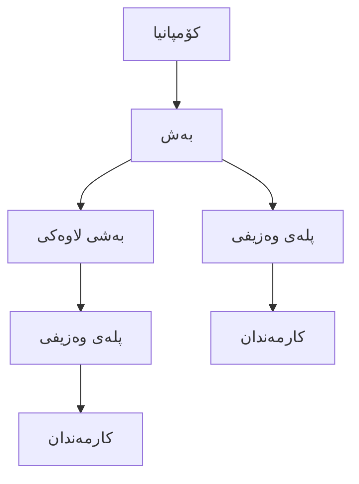

# ڕێکخستنی هێزی کار: بەشەکان و پلە وەزیفییەکان

ئەم ڕێنماییە ڕوونکردنەوەی چۆنێتی داڕشتنی پێکهاتەی ڕێکخراوەکەت دەدات لە جمێریار لە ڕێگەی دانانی بەشەکان و پلە وەزیفییەکان. وەک دروستکردنی "پەیکەری" کۆمپانیاکەت پێش زیادکردنی "گۆشت" (کارمەندان) و "ماسولکەکان" (گرێبەستەکان) بیربکەرەوە.

---

## ١. تێگەیشتن لە هەرمی کارگێڕی

لە جمێریار، پێکهاتەی ڕێکخراوەیی بەپێی ئەم ڕێڕەوە سادەیە دەڕوات:

- **بەشەکان**: دابەشکارییە سەرەکییەکانی کۆمپانیاکەت (وەک: فرۆشتن، سەرچاوە مرۆییەکان، تەکنەلۆژیای زانیاری).
- **بەشە لاوەکییەکان**: تیمە بچووکەکان لەناو بەشێکدا (وەک: "فرۆشتنی مەیدانی" لەژێر "فرۆشتن").
- **پلە وەزیفییەکان**: ڕۆڵە دیاریکراوەکان لەناو ئەو بەشانەدا (وەک: "بەڕێوەبەری فرۆشتن", "پسپۆڕی سەرچاوە مرۆییەکان").

---

## ٢. بەڕێوەبردنی بەشەکان

بەشەکان یارمەتیت دەدەن کارمەندان کۆبکەیتەوە، بەدواداچوونی تێچووەکان بکەیت، و پرۆسەی پەسەندکردنی کارەکان بەڕێوەببەیت.

### دروستکردنی بەش

بڕۆ بۆ: **ڕێکخستنەکان ← ڕێکخستنەکانی سەرچاوە مرۆییەکان ← بەشەکان**

لە کاتی دروستکردنی بەشێک، ئەم خانانە دەبینیتەوە:

| خانە | وەسف | نموونە |
|-------|-------------|---------|
| **ناو** | ناوی فەرمی بەشەکە. | خزمەتگوزارییە داراییەکان |
| **بەشی سەرەکی** | ئەگەر ئەمە یەکەیەکی لاوەکییە، بەشە سەرەکییەکەی هەڵبژێرە. | کارگێڕی |
| **بەڕێوەبەر** | سەرۆکی ئەم بەشە. | ئاراس ئەحمەد |
| **وەسف** | کورتەیەکی ڕۆڵی بەشەکە. | سەرپەرشتی هەموو فاکتەراکان و مووچە دەکات. |
| **چالاکە** | ئایا بەشەکە لە ئێستادا کاردەکات؟ | بەڵێ |

> [!TIP]
> دیاریکردنی **بەڕێوەبەر** بۆ بەشێک زۆر گرنگە چونکە زۆرێک لە پرۆسەکان (وەک پەسەندکردنی مۆڵەت) دەکرێت وا ڕێکبخرێن کە سەرەتا لە بەڕێوەبەری بەشەکەوە دەستپێبکەن.

---

## ٣. بەڕێوەبردنی پلە وەزیفییەکان

پلە وەزیفییەکان ئەو ڕۆڵە دیاریکراوانە پۆلین دەکەن کە لە کۆمپانیاکەتدا بەردەستن. وەک قاڵبێک کاردەکەن بۆ دامەزراندنی کارمەندان و گرێبەستەکان.

### دروستکردنی پلەی وەزیفی

بڕۆ بۆ: **ڕێکخستنەکان ← ڕێکخستنەکانی سەرچاوە مرۆییەکان ← پلە وەزیفییەکان**

#### زانیارییە سەرەکییەکان
- **ناونیشان**: ناوی فەرمی ڕۆڵەکە (بۆ نموونە: "ژمێریاری باڵا").
- **بەش**: ئەم ڕۆڵە سەر بە چ بەشێکە.
- **وەسف**: کورتەیەک دەربارەی ڕۆڵەکە.
- **پێداویستییەکان**: ئەو کارامەیی یان بڕوانامانەی پێویستن (بۆ نموونە: "بڕوانامەی CPA").
- **بەرپرسیارێتییەکان**: ئەرکە سەرەکییەکانی ئەم ڕۆڵە.

#### وردەکارییەکانی دامەزراندن
- **جۆری دامەزراندن**: کاتی تەواو، کاتی بەشەکی، گرێبەست، یان ڕاهێنان (Intern).
- **ئاست**: ئاستی پلەبەندی ڕۆڵەکە (سەرەتایی، جونیۆر، ناوەندی، باڵا، سەرپەرشتیار، بەڕێوەبەر، بەڕێوەبەری گشتی).
- **چالاکە**: پلە ناچالاکەکان ناتوانرێت بۆ کارمەندی نوێ بەکاربهێنرێن.

#### مەودای مووچە
ئەم بەشە یارمەتی سەرچاوە مرۆییەکان دەدات بۆ دیاریکردنی چاوەڕوانییەکانی مووچە:
- **دراو**: ئەو دراوەی بۆ مەودای مووچەکە بەکاردێت.
- **کەمترین مووچە**: کەمترین بڕی مووچە بۆ ئەم ڕۆڵە.
- **زۆرترین مووچە**: بەرزترین بڕی مووچە بۆ ئەم ڕۆڵە.

---

## ٤. کاریگەری لەسەر ڕەوتی کار

ڕێکخستنی دروستی ئەم بەشانە کاریگەری ڕاستەوخۆی هەیە لەسەر ڕەفتارەکانی تری سیستەمەکە:

- **پەسەندکردنی مۆڵەت**: ئەگەر بەشێک **بەڕێوەبەر**ی بۆ دیاریکرابێت، سیستەمەکە دەتوانێت ئەمە بەکاربهێنێت بۆ ناردنی داواکاری مۆڵەت بۆ پەسەندکردنی سەرەتایی.
- **ڕێکخستنی کارمەند**: لە کاتی زیادکردنی کارمەندێک، هەڵبژاردنی **پلەی وەزیفی** بە شێوەیەکی ئۆتۆماتیکی دەیبەستێتەوە بە بەشی دروست و ئاستی پلەبەندییەکەی دیاری دەکات.
- **ڕاپۆرتدان**: شیکارییەکانی سەرچاوە مرۆییەکان زۆرجار داتاکان بەپێی بەش کۆدەکەنەوە بۆ نیشاندانی ژمارەی کارمەندان و دابەشبوونی تێچووەکان.
- **گرێبەستەکان**: وردەکارییەکانی پلەی وەزیفی (وەک مەودای مووچە و جۆری دامەزراندن) وەک سەرچاوەیەک بەکاردێن لە کاتی نووسینی گرێبەستی نوێی کار.

---

## ٥. باشترين شێوازەکان بۆ ڕێکخستن

١. **پۆلێنکردنی لۆژیکی**: بەشە سەرەکییەکان بەکاربهێنە بۆ ڕەنگدانەوەی پێکهاتەی ڕاستەقینەی ڕاپۆرتدان (بۆ نموونە: نووسینگەی هەرێمی -> لق).
٢. **ناونیشانی ستاندارد**: ناونیشانی وەزیفی یەکگرتوو بەکاربهێنە بۆ دڵنیابوون لە وردی ڕاپۆرتەکان لە هەموو کۆمپانیاکەدا.
٣. **دیاریکردنی بەڕێوەبەر**: هەمیشە بەڕێوەبەرێک بۆ بەشەکان دابنێ بۆ دڵنیابوون لەوەی پرۆسەکانی پەسەندکردن بە دروستی کاردەکەن.
٤. **باری چالاک**: لەبری سڕینەوەی ڕۆڵە کۆنەکان، وەک **ناچالاک** نیشانیان بدە بۆ پاراستنی داتای مێژوویی کارمەندان.

---

## ٦. هەنگاوەکانی داهاتوو

کاتێک بەش و پلە وەزیفییەکانت ڕێکخست، دەتوانیت:
- [کارمەندان زیاد بکەیت](employee-management.ckb.md) بۆ ئەم پلە وەزیفییانە.
- پلە وەزیفییەکان ببەستیتەوە بە [گرێبەستەکانی کار](work-contracts.ckb.md).
- فلتەری بەشەکان بەکاربهێنیت لە [ڕاپۆرتەکانی سەرچاوە مرۆییەکان](analytic-report.ckb.md).
