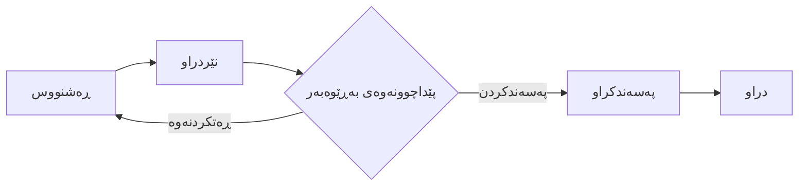

# ڕاپۆرتەکانی خەرجی: بەڕێوەبردنی خەرجییە بازرگانییەکان

ئەم ڕێبەرییە ڕوونی دەکاتەوە چۆن بەڕێوەبردنی خەرجییەکانی کارمەند دەکرێت، لە ناردنی داواکارییەوە تا وەرگرتنەوەی پارە. جا تۆ کارمەندێک بیت کە پسووڵەکان دەنێریت یان بەڕێوەبەرێک بیت کە پەسەندیان دەکەیت، ئەم ڕێبەرییە هەموو پرۆسەکە دەگرێتەوە.

---

## ڕاپۆرتی خەرجی چییە؟

**ڕاپۆرتی خەرجی** (Expense Report) بەڵگەنامەیەکە کە هەموو تێچوونە بازرگانییەکانی کارمەندێک لە ماوەیەکی دیاریکراودا کۆدەکاتەوە (وەک گەشتێکی بازرگانی یان مانگێک). وەک داواکارییەکی فەرمی کار دەکات بۆ وەرگرتنەوەی پارە.

**بۆچی بەکاری دەهێنین؟**
1.  **وەرگرتنەوەی پارە**: دڵنیایی دەدات کە کارمەندان پارەکەیان وەردەگرنەوە لە بەرامبەر بەکارهێنانی پارەی خۆیان بۆ کاری کۆمپانیا.
2.  **بەدواداچوون**: تۆمارێک دەهێڵێتەوە بۆ ئەوەی بزانرێت کۆمپانیا چەند خەرج دەکات بۆ گەشت، خواردن، و پێداویستییەکان.
3.  **پەسەندکردن**: ڕێگە بە بەڕێوەبەران دەدات پێداچوونەوە بە تێچوونەکاندا بکەن پێش ئەوەی پارەکە بدرێت.

> **💡 نموونەیەکی واقعی**:  
> تەسەور بکە گەشتت کردووە بۆ کۆبوونەوەیەکی کڕیار. پارەی تاکسیت داوە، نانی نیوەڕۆت کڕیوە، و لە هۆتێل ماویتەتەوە. تۆ *یەک* ڕاپۆرتی خەرجی دروست دەکەیت بۆ "سەردانی کڕیار - ئازار" و *سێ* هێڵ (تاکسی، نانی نیوەڕۆ، هۆتێل)ی تێدا زیاد دەکەیت.

---

## لە کوێ دەیدۆزیتەوە؟

بڕۆ بۆ: **سەرچاوە مرۆییەکان ← ڕاپۆرتەکانی خەرجی**

لیستێک لە هەموو ڕاپۆرتەکانی خەرجیت دەبینیت.
- **کارمەندان** ڕاپۆرتەکانی خۆیان دەبینن.
- **بەڕێوەبەران/HR** ئەو ڕاپۆرتانە دەبینن کە بۆ پەسەندکردن نێردراون.

---

## ڕەوتی کارکردنی خەرجی

ڕاپۆرتێکی خەرجی بەم قۆناغانەدا تێدەپەڕێت:



1.  **ڕەشنووس (Draft)**: هێشتا پسووڵەکان زیاد دەکەیت و وردەکارییەکان دەستکاری دەکەیت.
2.  **نێردراو (Submitted)**: ناردووتە بۆ بەڕێوەبەرەکەت. چیتر ناتوانیت دەستکاری بکەیت.
3.  **پەسەندکراو (Approved)**: بەڕێوەبەر خەرجییەکانی قبوڵ کردووە.
4.  **دراو (Paid)**: ژمێریاری پارەکەی بۆ گەڕاندوویتەتەوە (لە ڕێگەی مووچە یان پارەدانی ڕاستەوخۆ).

---

## دروستکردنی ڕاپۆرتێکی خەرجی

### هەنگاوی ١: دروستکردنی سەردێڕی ڕاپۆرتەکە

1.  بڕۆ بۆ **سەرچاوە مرۆییەکان ← ڕاپۆرتەکانی خەرجی**.
2.  کلیک لە **دروستکردنی ڕاپۆرتی خەرجی** بکە.
3.  وردەکارییە بنچینەییەکان پڕبکەرەوە:
    *   **وەسف**: ناوی ڕوون (نموونە: "گەشتی دوبەی - تشرینی یەکەم ٢٠٢٣").
    *   **کارمەند**: ناوی تۆ (بەزۆری خۆکارانە پڕ دەبێتەوە).
    *   **ڕێکەوت**: ڕێکەوتی ناردن.

### هەنگاوی ٢: زیادکردنی هێڵەکانی خەرجی

لە بەشی **هێڵەکانی خەرجی**، کلیک لە **زیادکردنی بڕگە** بکە بۆ هەر پسووڵەیەک:

| بوار | چی بنووسیت |
| :--- | :--- |
| **وەسف** | چیت کڕیوە؟ (نموونە: "تاکسی بۆ فڕۆکەخانە") |
| **جۆر** | جۆرێک هەڵبژێرە (گەشت، خواردن، پێداویستی نووسینگە). |
| **ڕێکەوت** | ڕێکەوتی سەر پسووڵەکە. |
| **بڕ** | کۆی ئەو پارەیەی داوتە. |
| **دراو** | ئەگەر بە دراوی بیانی پارەت داوە (وەک دۆلار)، لێرە دیاری بکە. |

> **[!TIP]**
> دەتوانیت وێنەی پسووڵەکان ڕابکێشیت و فڕێی بدەیتە ناو بەشی **پاشکۆکان**ی هەر هێڵێک بە تەنها بۆ بەڵگە!

### هەنگاوی ٣: ناردن بۆ پەسەندکردن

کاتێک هەموو خەرجییەکانت زیاد کرد:
1.  پێداچوونەوە بە **کۆی گشتی** بکە.
2.  کلیک لە **ناردن بۆ بەڕێوەبەر** بکە.

---

## بۆ بەڕێوەبەران: پەسەندکردنی خەرجییەکان

کاتێک کارمەندێک ڕاپۆرتێک دەنێرێت، ئاگانامەیەکت پێ دەگات.

1.  **ڕاپۆرتی خەرجی** بکەرەوە.
2.  پێداچوونەوە بە هەر بڕگەیەک و پسووڵە هاوپێچکراوەکان بکە.
3.  **کردار**:
    *   **پەسەندکردن**: ئەگەر هەموو شتێک ڕاست بوو.
    *   **ڕەتکردنەوە**: ئەگەر خەرجییەکان پێچەوانەی سیاسەت بوون یان پسووڵەیان کەم بوو. (دەتوانیت تێبینی بنووسیت و ڕوونی بکەیتەوە بۆچی).

---

## کاریگەری ژمێریاری

کاتێک ڕاپۆرتێکی خەرجی **پەسەند دەکرێت** و **دەنێردرێت (Posted)**، سیستمەکە تۆمارێکی ڕۆژانە دروست دەکات:

```
قەرزدار. خەرجی گەشت              ١٥٠.٠٠٠
قەرزدار. خەرجی خواردن               ٥٠.٠٠٠
    قەرزدەر. پارەی شایستەی کارمەند        ٢٠٠.٠٠٠
```

*   **قەرزدار (Debit)**: هەژمارەکانی خەرجی کۆمپانیا زیاد دەکات.
*   **قەرزدەر (Credit)**: ئەو بڕە زیاد دەکات کە کۆمپانیا قەرزاری کارمەندەکەیە (الالتزام).

---

## چارەسەرکردنی کێشە و پرسیارە باوەکان

**پرسیار: لەبیرم چوو پسووڵەیەک زیاد بکەم بۆ ڕاپۆرتێکی نێردراو!**
وەڵام: داوا لە بەڕێوەبەرەکەت بکە ڕاپۆرتەکە "ڕەت بکاتەوە" (Refuse). دەگەڕێتەوە بۆ دۆخی **ڕەشنووس**، و دەتوانیت پسووڵە ونبووەکە زیاد بکەیت و دووبارە بینێریتەوە.

**پرسیار: دەتوانم داوای پێشینە (Advance Payment) بکەم؟**
وەڵام: نەخێر، ڕاپۆرتەکانی خەرجی بۆ **وەرگرتنەوەی پارەیە** (ئەو پارەیەی پێشتر خەرجت کردووە). بۆ پارەی پێشینە، تایبەتمەندی **Cash Advance** لە بەشی سەرچاوە مرۆییەکان بەکاربهێنە.

**پرسیار: ئەگەر پسووڵەیەکم ون کرد چی؟**
وەڵام: سەیری سیاسەتی کۆمپانیاکەت بکە. بەزۆری، پێویستە ڕوونکردنەوەیەکی نووسراو یان وێنەیەکی ڕاپۆرتی بانک پێشکەش بکەیت.

---

## بەڵگەنامە پەیوەندیدارەکان

*   [بەڕێوەبردنی کارمەند](employee-management.md)
*   [تێگەیشتن لە پێشینەکان](understanding-cash-advances.md)
*   [سیاسەتەکان و پەسەندکردنەکان](department-position-config.md)
