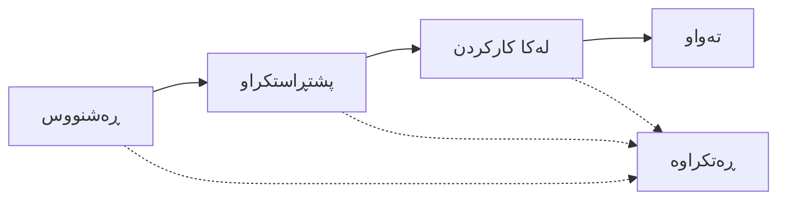

# فەرمانەکانی بەرهەمهێنان (Manufacturing Orders)

## تێڕوانینی گشتی

فەرمانەکانی بەرهەمهێنان (MOs) بریتین لە فەرمانی کار کە ڕێنمایی تیمی بەرهەمهێنان دەکەن بۆ دروستکردنی کاڵای تەواو لە کەرەستەی خاوەوە بەپێی لیستی کەرەستەکان (BOM). سیستەمەکە چاودێری تەواوی سوڕی ژیانی بەرهەمهێنان دەکات لە پلاندانانەوە تا تەواوکردن.

## سوڕی ژیانی فەرمانی بەرهەمهێنان

### پێناسەی دۆخەکان

- **ڕەشنووس (Draft)**: MO پلان بۆ دانراوە، دەکرێت دەستکاری بکرێت
- **پشتڕاستکراو (Confirmed)**: MO پەسەند کراوە و ئامادەیە بۆ دەستپێکردن
- **لە کارکردن (In Progress)**: بەرهەمهێنان دەستی پێکردووە، پێکهاتەکان بەکاردەهێنرێن
- **تەواو (Done)**: بەرهەمهێنان تەواو بووە، کاڵای تەواو وەرگیراوە
- **ڕەتکراوە (Cancelled)**: MO ڕەتکراوەتەوە پێش تەواو بوون

## دروستکردنی فەرمانی بەرهەمهێنان

### ڕێگای ١: لە لیستی کەرەستەکانەوە (BOM)
1. بڕۆ بۆ **بەرهەمهێنان (Manufacturing)** ← **لیستی کەرەستەکان (Bills of Materials)**
2. ئەو BOMـە بکەرەوە کە دەتەوێت بەرهەمی بهێنیت
3. کلیک لەسەر **Create Manufacturing Order** بکە
4. سیستەمەکە BOM و بەرهەمەکە پڕ دەکاتەوە

### ڕێگای ٢: دروستکردنی ڕاستەوخۆ
1. بڕۆ بۆ **بەرهەمهێنان** ← **فەرمانەکانی بەرهەمهێنان**
2. کلیک لەسەر **New Manufacturing Order** بکە
3. خانە پێویستەکان پڕ بکەرەوە

### زانیاری پێویست

**بەرهەم و BOM**
- **لیستی کەرەستەکان**: BOMـەکە هەڵبژێرە
- **بەرهەم**: خۆکار پڕ دەبێتەوە لە BOMـەوە (بەرهەمی تەواو)
- **بڕی بەرهەمهێنان**: چەند یەکە دروست دەکەیت

**شوێنەکان**
- **شوێنی سەرچاوە**: کەرەستەی خاو لە کوێوە دەهێنرێت
- **شوێنی مەبەست**: کاڵای تەواو لە کوێ دادەنرێت

**خشتەکاری (Scheduling)**
- **بەرواری دەستپێکری پلان بۆ دانراو**: کەی دەبێت دەست پێ بکات
- **بەرواری کۆتایی پلان بۆ دانراو**: کەی چاوەڕوان دەکرێت تەواو بێت

## کارەکانی فەرمانی بەرهەمهێنان

### پشتڕاستکردنەوەی MO
**کەی**: دوای دروستکردن و پێداچوونەوەی MO
**کردار**: کلیک لەسەر دوگمەی **Confirm** بکە
**کاریگەری**:
- دۆخ دەگۆڕێت بۆ **Confirmed**
- ژمارەی MO دادەنرێت (ئەگەر دانەنرابێت)
- پێکهاتە پێویستەکان هەڵدەگیرێن (reserved)
- چیتر دەستکاری ناکرێت

### دەستپێکردنی بەرهەمهێنان
**کەی**: بەرهەمهێنان دەست پێدەکات
**کردار**: کلیک لەسەر دوگمەی **Start Production** بکە
**کاریگەری**:
- دۆخ دەگۆڕێت بۆ **In Progress**
- بەرواری دەستپێکی ڕاستەقینە تۆمار دەکرێت
- بەکارهێنانی پێکهاتە دەتوانێت دەست پێ بکات

### تەواوکردنی بەرهەمهێنان
**کەی**: هەموو یەکەکان دروستکران
**کردار**: کلیک لەسەر دوگمەی **Complete Production** بکە
**کاریگەری**:
- دۆخ دەگۆڕێت بۆ **Done**
- بەرواری کۆتایی ڕاستەقینە تۆمار دەکرێت
- پێکهاتەکان لە کۆگا بەکاردەهێنرێن (consumed)
- کاڵای تەواو لە کۆگا وەردەگیرێت
- **قەیدی ژمێریاری دروست دەکرێت**:
  - Debit: کۆگای کاڵای تەواو (Finished Goods Inventory)
  - Credit: کۆگای کەرەستەی خاو (Raw Materials Inventory)
### ڕەتکردنەوەی MO (Cancellation)

**کەی**: کاتێک MO چیتر پێویست نییە یان بە هەڵە دروستکراوە
**کردار**: کلیک لەسەر دوگمەی **Cancel** بکە (بەردەستە لە Header یان Table)
**بەردەستە بۆ**: دۆخەکانی **ڕەشنووس**، **پشتڕاستکراو**، یان **لە کارکردن**
**کاریگەری**:
- دۆخ دەگۆڕێت بۆ **ڕەتکراوە (Cancelled)**
- **پاککردنەوەی کۆگا**: هەموو ئەو کاڵایانەی بۆ ئەم MOـە هەڵگیرابوون (reserved) بە شێوەیەکی ئۆتۆماتیکی ئازاد دەکرێن.
- **فەرمانەکانی کار (Work Orders)**: هەموو فەرمانەکانی کار کە پەیوەندیدارن و هێشتا تەواو نەبوون، دەگۆڕێن بۆ دۆخی **ڕەتکراوە**.
- **پاراستنی زانیاری**: کاتێک MO ڕەتکرایەوە، ناتوانیت دوباره چالاکی بکەیتەوە.

**ڕێگرییەکان**:
- **ڕێگری لە بەکارهێنان**: ناتوانیت MO ڕەت بکەیتەوە ئەگەر هیچ پێکهاتەیەک بەکارهێنرابێت (کاتی جوڵەی کۆگا Done بێت).
- **ڕێگری لە بەرهەمهێنان**: ناتوانیت MO ڕەت بکەیتەوە ئەگەر هیچ بڕێکی لێ بەرهەم هێنرابێت.
- **پێشنیار**: ئەگەر بەرهەمهێنان دەستی پێکردووە و کەرەستەکان بەکارهێنراون، باشترە فەرمانەکە تەواو بکەیت و پاشان بە "Return" یان گۆڕانکاری دەستی لە کۆگا شوێنەوارەکەی چاک بکەیتەوە.

## بەکارهێنانی پێکهاتە

### بەکارهێنانی ئۆتۆماتیکی
کاتێک فەرمانی بەرهەمهێنان تەواو دەکەیت:
1. سیستەم بڕی پێویست هەژمار دەکات لە BOMـەوە
2. پێکهاتەکان لە شوێنی سەرچاوە بەکاردەهێنرێن
3. جوڵەی کۆگا دروست دەکرێت بۆ وردبینی
4. بەهای کۆگا نوێ دەکرێتەوە

## وەرگرتنی کاڵای تەواو

### وەرگرتنی ئۆتۆماتیکی
کاتێک بەرهەمهێنان تەواو دەبێت:
1. کاڵای تەواو وەردەگیرێت لە شوێنی مەبەست
2. بڕی دروستکراو تۆمار دەکرێت
3. تێچووی بەرهەم هەژمار دەکرێت لە بەکارهێنانی پێکهاتەکانەوە

## تەواوکاری ژمێریاری

### دروستکردنی قەید (Journal Entry)
لەگەڵ تەواوبوونی MO، سیستەمەکە قەیدێک دروست دەکات:

**Debit**: هەژماری کۆگای کاڵای تەواو
- بڕ: کۆی تێچووی پێکهاتە بەکارهاتووەکان

**Credit**: هەژماری کۆگای کەرەستەی خاو
- بڕ: کۆی تێچووی پێکهاتە بەکارهاتووەکان

---

## بابەتە پەیوەندیدارەکان
- [لیستی کەرەستەکان](bill-of-materials.md)
- [بەڕێوەبردنی کۆگا](inventory-management.md)
- [چەمکەکانی بەرهەمهێنان](../explanation/manufacturing-concepts.md)
- [ناوەندەکانی کار](../explanation/understanding-work-centers.md)
- [جوڵەکانی کۆگا](stock-movements.md)
