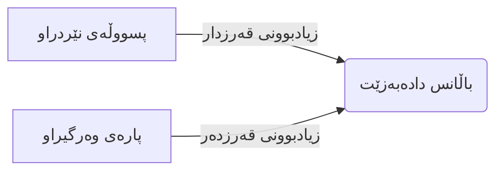
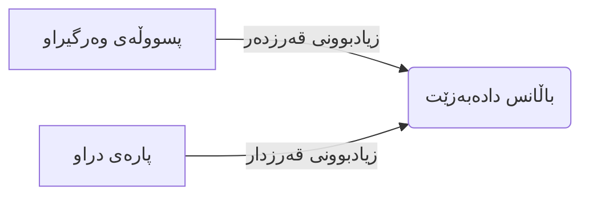

# ڕاپۆرتی پەرتووکی هاوبەش: مێژووی هاوبەشەکانت

ئەم ڕێبەرە ڕوونی دەکاتەوە کە **ڕاپۆرتی پەرتووکی هاوبەش** چۆن کاردەکات. جا تۆ چاودێری مێژووی پارەدانی کڕیارێک دەکەیت یان پێداچوونەوە دەکەیت کە چەند قەرزاری فرۆشیارێکیت، ئەم ڕاپۆرتە وێنە تەواوەکەت پێ دەبەخشێت.

---

## پەرتووکی هاوبەش چییە؟

پەرتووکی هاوبەش وەک **پەرتووکێکی مێژوویی** ورد وایە بۆ کەسێکی دیاریکراو یان کۆمپانیایەک کە کاری لەگەڵ دەکەیت. هەموو مامەڵەیەکی تاک لەنێوان تۆ و ئەواندا پیشان دەدات - پسووڵەی فرۆشتن، پسووڵەی کڕین، پارەدان، و گەڕاندنەوەکان - بە ڕیزبەندی کاتی.

**بۆچی ئەمە گرنگە؟**
1.  **چارەسەرکردنی ناکۆکی**: ئەگەر کڕیارێک بانگەشەی کرد سکاڵایەکی داوە، دەتوانیت بە تەواوی و کەی پارەکە وەرگیراوە ببینیت.
2.  **هاوتاکردن**: دڵنیابوونەوە کە تۆمارەکانت لەگەڵ ئەو بەیاننامەیە دەگونجێت کە لەلایەن هاوبەشەکەتەوە نێردراوە.
3.  **شوێنپێهەڵگرتنی وردبینی**: بینینی تەواوی چیرۆکی باڵانسی هەژمارێک، لە سەرەتاوە تا کۆتایی.

> [!NOTE]
> بە پێچەوانەی ڕاپۆرتەکانی **قەرزی کۆن کە دەبێت وەربگیرێت/بدرێت** کە تەنها بڕە **پاره نەدراوەکان** پیشان دەدەن، پەرتووکی هاوبەش **هەموو شتێک** پیشان دەدات - بە پسووڵە پێدراوەکان و مامەڵە داخراوەکانیشەوە.

---

## لە کوێ دەیدۆزیتەوە؟

بڕۆ بۆ: **ژمێریاری -> ڕاپۆرتەکان -> پەرتووکی هاوبەش**

هەروەها زۆرجار دەتوانیت لە ڕێگەی ئەمانەوە دەستت بەم زانیارییە بگات:
- **پرۆفایلی هاوبەش**: کلیککردن لەسەر تاب-ی "پەرتووک" یان "مێژوو" بۆ کڕیار یان فرۆشیارێکی دیاریکراو.

---

## بەکارهێنانی ڕاپۆرتەکە

### هەنگاوی 1: پاڵاوتنی بینینەکەت

کاتێک ڕاپۆرتەکە دەکەیتەوە، پێویستە دەستنیشانی بکەیت سەیری چی دەکەیت:

| فیلتەر | چی هەڵبژێریت |
|--------|----------------|
| **هاوبەش** | کڕیار یان فرۆشیار دیاریکراو هەڵبژێرە کە دەتەوێت لێکۆڵینەوەی بۆ بکەیت. |
| **ڕێکەوتی دەستپێک** | سەرەتای ئەو ماوەیەی کە مەبەستتە. |
| **ڕێکەوتی کۆتایی** | کۆتایی ماوەکە (بەزۆری ئەمڕۆ یان کۆتایی مانگ). |

> [!TIP]
> ئەگەر `(⚠️ Missing Accounts)` لە تەنیشت ناوی هاوبەشێکەوە دەبینیت، واتە پرۆفایلەکەیان هەژماری وەرگرتن یان هەژماری پێدانی نییە. پێویستە ئەمە چاک بکەیت لە ڕێکخستنەکانی پرۆفایلەکەیان پێش ئەوەی داتای ورد ببینیت.

### هەنگاوی 2: دروستکردن

کلیک لە **دروستکردنی ڕاپۆرت** بکە بۆ بارکردنی داتاکە.

### هەنگاوی 3: تێگەیشتن لە ستوونەکان

ڕاپۆرتەکە خشتەیەک بەم ستوونانە پیشان دەدات:

| ستوون | وەسف |
|--------|-------------|
| **ڕێکەوت** | کەی مامەڵەکە ڕوویداوە. |
| **ژمارەی بەڵگە** | ژمارەی بەڵگەنامەکە (بۆ نموونە، پسووڵەی ژمارە #INV-2024-001). |
| **جۆری مامەڵە** | چ جۆرە ڕووداوێک بووە (پسووڵەی فرۆشتن، پسووڵەی کڕین، پارەدان، هتد). |
| **قەرزدار (Debit)** | زیادکردنی ئەوەی کڕیارێک قەرزاری تۆیە (یان کەمکردنەوەی ئەوەی تۆ قەرزاری فرۆشیارێکیت). |
| **قەرزدەر (Credit)** | کەمکردنەوەی ئەوەی کڕیارێک قەرزاری تۆیە (یان زیادکردنی ئەوەی تۆ قەرزاری فرۆشیارێکیت). |
| **باڵانس** | کۆی گشتی هەژمارەکە دوای ئەم مامەڵەیە. |

---

## تێگەیشتن لە ژمێریاری

### 🏦 ڕۆیشتنی پارە

لێرەدا چۆن کردارە باوەکان کاریگەرییان لەسەر پەرتووکەکە هەیە:

**بۆ کڕیارێک (وەردەگیرێت):**

**بۆ فرۆشیارێک (دەدرێت):**

---

## سیناریۆ باوەکان

### سیناریۆی 1: سەلماندنی پارەدان

**بارودۆخەکە**: فرۆشیارەکەت، "کۆمپانیای تەکنەلۆژیا"، دەڵێت تۆ پسووڵەی #BILL-999 بە بڕی 500$ ت نەداوە.

**ئەوەی دەبێت بیکەیت:**
1.  **پەرتووکی هاوبەش** بکەرەوە.
2.  **کۆمپانیای تەکنەلۆژیا** هەڵبژێرە.
3.  مەودای ڕێکەوتەکە دیاری بکە بۆ داپۆشینی ڕێکەوتی پسووڵەکە تا ئەمڕۆ.
4.  سەیری ئەو هێڵە بکە کە ژمارەی بەڵگە #BILL-999 تێدایە.
5.  سەیری مامەڵەی **پارەدان** بکە لە دوای ئەوەوە کە باڵانسەکە کەم دەکاتەوە.

**ئەنجام**: پارەدانێک دەدۆزیتەوە لە 15ی کانوونی دووەم بە بڕی 500$. دەتوانیت ئەم ڕاپۆرتە دەربهێنیت و بۆیان بنێریت وەک بەڵگە.

### سیناریۆی 2: لێکۆڵینەوە لە باڵانس

**بارودۆخەکە**: باڵانسی کڕیارێک 150$ ە، بەڵام تۆ وات داناوە هەموو پارەکەیان داوە.

**ئەوەی دەبێت بیکەیت:**
1.  ڕاپۆرتەکە بۆ ئەو کڕیارە دروست بکە.
2.  سەیری ستوونی **باڵانسی ڕاکەر** بکە.
3.  شوێنپێی هەڵبگرە بۆ دواوە بۆ دۆزینەوەی ئەو شوێنەی کە بە ئەرێنی ماوەتەوە.
4.  ڕەنگە پسووڵەیەکی بچووکی 150$ بدۆزیتەوە لە 6 مانگ لەمەوبەر کە لەدەست چووە، یان ڕەنگە پارەدانێکی بەشەکی کە کەمتر پارەیان داوە بۆ پسووڵەیەک.

---

## چارەسەرکردنی کێشەکان

### ئاگادارکردنەوە: هەژمارە ونبووەکان

**"ناوی هاوبەش (⚠️ Missing Accounts)"**
ئەم ئاگادارکردنەوەیە لە لیستەکەدا دەردەکەوێت. واتە سیستەمەکە نازانێت کام هەژماری په ڕتووکی گشتی بەکاربهێنێت بۆ ئەم هاوبەشە.
*   **چارەسەر**: بڕۆ بۆ **هاوبەشەکان**، ئەم هاوبەشە دەستکاری بکە، و "هەژماری وەرگرتن" و "هەژماری پێدان" دیاری بکە.

### باڵانسەکان یەکتری ناگرنەوە

ئەگەر باڵانسی پەرتووکی هاوبەش لەگەڵ پەرتووکی گشتی یەکتری نەگرتەوە:
1.  **پشکنینی مەودای ڕێکەوت**: دڵنیابە کە مامەڵەکانی داهاتووت فیلتەر نەکردووە کە کاریگەرییان لەسەر باڵانسی ئێستا هەیە.
2.  **تۆمارە دەستییەکانی ڕۆژانە**: ئایا کەسێک تۆمارێکی دەستی کردووە لەسەر هەژماری گشتی بەبێ ئاماژەکردن بە هاوبەشەکە؟ ئەمە دەبێتە هۆی جیاوازی. هەمیشە ئاماژە بە هاوبەشەکە بکە لە تۆمارە دەستییەکاندا!

---

## باشترین پراکتیزەکان

*   **هاوتاکردنی بەردەوام**: مانگانە پەرتووکی فرۆشیارە سەرەکییەکان لەگەڵ بەیاننامەکانیان پێک بگرە.
*   **چاککردنی "هەژمارە ونبووەکان"**: ئاگادارکردنەوەکان پشتگوێ مەخە؛ نەخشەسازی هەڵەی هەژمار دەبێتە هۆی پەرتووکی شێواو.
*   **بەکارهێنانی ژمارەی بەڵگە**: هەمیشە ژمارەی پسووڵەی فرۆشتن یان کڕین لە خانەی ژمارەی بەڵگە بنووسە بۆ ئەوەی بە ئاسانی بیدۆزیتەوە.

---

## بەڵگەنامە پەیوەندیدارەکان

*   [ڕاپۆرتی قەرزی کۆن کە دەبێت وەربگیرێت](aged-receivables-report.ckb.md) - تەنها پسووڵە نەدراوەکانی کڕیار ببینە.
*   [ڕاپۆرتی قەرزی کۆن دەبێت بدرێت](aged-payables-report.ckb.md) - تەنها پسووڵە نەدراوەکانی فرۆشیار ببینە.
*   [ڕاپۆرتی پەرتووکی گشتی](general-ledger-report.ckb.md) - تۆماری سەرەکی هەموو هەژمارەکان.
