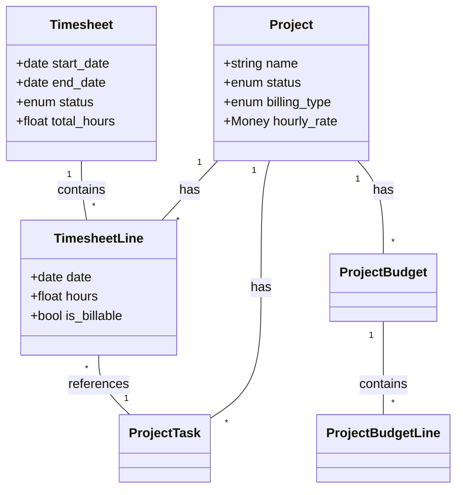

# Project Management Architecture

This developer guide explains the **Project Management module** architecture—how projects, tasks, timesheets, budgets, and invoicing work together. It covers the data model, service layer, integration points, and design decisions.

---

## Module Overview

The Project Management module provides job costing functionality:

| Feature | Models |
| :--- | :--- |
| **Projects** | `Project`, `ProjectTask` |
| **Timesheets** | `Timesheet`, `TimesheetLine` |
| **Budgets** | `ProjectBudget`, `ProjectBudgetLine` |
| **Invoicing** | `ProjectInvoice` |

**Module Location:** `Modules/ProjectManagement/`

---

## Core Data Model

---

## Key Services

### TimesheetService
Manages the submission and approval workflow.
- `submitTimesheet()`: Validates and transitions to Submitted.
- `approveTimesheet()`: Locks record, triggers cost calculation.
- `rejectTimesheet()`: Reverts to Draft with a reason.

### ProjectCostingService
Aggregates costs from multiple sources (Labor, Expenses) to calculate Real-time Budget Actuals.

### ProjectInvoicingService
Generates `ProjectInvoice` records by aggregating unbilled, approved `TimesheetLine` records for T&M projects.

---

## Integration Points

1.  **Foundation (Partners)**: Projects link to `Partner` for customer data.
2.  **HR (Employees)**: Timesheets link to `Employee` records.
3.  **Accounting (GL)**: Expenses and Invoices generate Journal Entries (future scope/integration).

---

## Related Documentation
- [Project Concepts](project-concepts.md)
- [Project Reference](../reference/project-fields-and-statuses.md)
