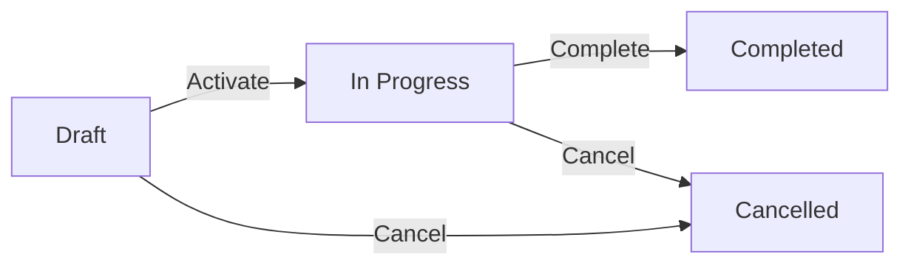

# Project Management Concepts

**Project Management** in Kezi ERP connects your daily work to your accounting system, ensuring you always know if a project is profitable. It involves planning, executing, and monitoring work to achieve specific goals within time and budget constraints.

---

## 🏗️ Core Concepts

### 1. Projects
The central container for all work. A project represents a specific engagement or job, such as "Office Building for ABC Corp" or "Q1 Marketing Campaign".
- Links to a **Customer** for billing.
- Has a specific **Billing Type**.
- Accumulates costs and revenues.

### 2. Tasks
Specific pieces of work within a project.
- **Example**: "Foundation", "Electrical", "UI Design".
- Assigned to specific employees.
- Track progress via stages (To Do, In Progress, Done).

### 3. Timesheets
Records of hours worked by employees on specific tasks.
- **Billable**: Charged to the client.
- **Non-Billable**: Internal cost only.
- Must be approved by a manager before affecting costs.

### 4. Budgets
Planned costs versus actual spending.
- **Budgeted**: What you planned to spend.
- **Actual**: What you actually spent (labor + expenses).
- **Variance**: The difference (Under/Over budget).

---

## 🔄 Project Lifecycle

Every project moves through a standard lifecycle:

| Status | Description |
| :--- | :--- |
| **Draft** | Project is being planned. No timesheets can be logged. |
| **In Progress** | Work is actively happening. Timesheets and bills can be recorded. |
| **Completed** | All work finished. Final invoicing done. No new costs allowed. |
| **Cancelled** | Project stopped early. Activity frozen. |

---

## 💰 Billing Types

How you charge your client determines the project structure:

### Time & Materials (T&M)
- **Bill clients based on actual hours worked.**
- Each hour has a rate (e.g., $150/hour).
- **Best for**: Consulting, software development, creative work.

### Fixed Price
- **Bill a set amount regardless of hours.**
- You charge $20,000 whether it takes 100 or 200 hours.
- **Best for**: Construction, well-defined deliverables.

### Non-Billable
- **Internal projects with no invoicing.**
- **Best for**: Training, R&D, internal tools.

---

## Related Documentation
- [How to Manage Projects](../how-to/manage-projects.md)
- [Understanding Project Tasks](understanding-project-tasks.md)
- [Project Architecture](project-architecture.md)
