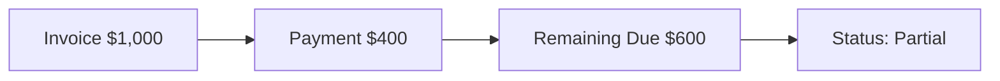

# Advanced Payment Scenarios: Handling Real-World Money Flow

This guide explains how to handle complex payment situations like partial payments, overpayments, and prepayments. Whether a customer pays early, pays too much, or pays in installments, we've got you covered.

---

## What are Advanced Payment Scenarios?

In the real world, payments don't always match invoices exactly.
- **Partial Payments**: Paying a large bill in smaller chunks.
- **Overpayments**: Sending more money than the invoice due.
- **Prepayments**: Paying before the invoice even exists.

Understanding these scenarios helps you keep your books accurate and your customers happy.

---

## Partial Payments

A **Partial Payment** happens when a customer pays less than the full invoice amount. The system keeps track of what's paid and what's still owed.

### The Workflow

Here is how a partial payment flows through the system:

### Understanding Statuses

The system uses statuses to tell you where an invoice stands:

| Status | Meaning |
|--------|---------|
| **Open** | No payment has been made yet. Full amount due. |
| **Partial** | Some payment received, but balance remains. |
| **Paid** | Fully paid. Balance is $0. |

### Example

1. You send an invoice for **$1,000**.
2. Customer pays **$400**.
3. You record a payment of $400 against the invoice.
4. The invoice status changes to **Partial**.
5. The **Amount Due** shows **$600**.

6. Later, the customer pays the remaining **$600**.
7. You record the second payment.
8. The invoice status changes to **Paid**.

---

## Overpayments

An **Overpayment** occurs when a customer pays more than they owe. This creates a "Credit" on their account that can be used later.

### Scenario

> **Scenario**: You send an invoice for **$1,000**. The customer accidentally writes a check for **$1,200**.

### What to Do

You have two main options:

1.  **Keep as Credit**: Record the full $1,200 payment. The invoice will be marked as paid, and the extra $200 sits on their account as a credit. Next time you invoice them, the system will ask if you want to use this outstanding credit.
2.  **Refund**: Issue a refund for the $200 difference back to the customer.

### How the System Handles It

When you validate a payment larger than the invoice:
1. The invoice is marked **Paid**.
2. The extra amount is recorded as an **Outstanding Credit** for that partner.
3. You will see this credit on the Partner Ledger and typically on the next invoice creation screen as an option to apply.

---

## Prepayments (Advance Payments)

A **Prepayment** is money received *before* an invoice is created. This is common for deposits or custom orders.

### Use Case

> **Use Case**: A customer wants to order custom furniture. You require a **50% deposit** before you start work.

### How to Record

1.  Go to **Accounting → Customers → Payments**.
2.  Create a new Payment for the amount received (e.g., $500).
3.  Do **not** link it to an invoice (leave the invoice field empty/unselected).
4.  Select the **Partner** name.
5.  Click **Confirm**.

Later, when you create the final invoice:
1. The system will detect the existing payment for that partner.
2. It will show a notification prompt to **Add** this outstanding credit to the new invoice.
3. Clicking "Add" applies the prepayment to reduce the invoice due amount.

> [!TIP]
> This is exactly like an "Opening Balance" payment—it's money you hold for the customer until it's applied to a valid bill.

---

## Multi-Currency Payments

Dealing with international clients? You can receive payments in a different currency than the invoice.

- **Invoice**: Issued in **USD ($)**.
- **Payment**: Received in **EUR (€)**.

**Key Concepts**:
- **Exchange Rate**: The system uses the rate effective at the *date of payment*.
- **Gain/Loss**: If the exchange rate changed between the invoice date and payment date, the difference is automatically recorded in the **Exchange Gain/Loss** account.

---

## Best Practices

### 🔄 Reconciliation
- **Check Partner Ledgers**: Regularly review partner balances to ensure credits are applied or refunded.
- **Clear Old Credits**: Don't let small overpayments sit forever. Apply them to new invoices or write them off if insignificant.

### 📝 Clear Communication
- Send **Statements** to customers so they know their remaining balance (for partials) or available credit (for over/prepayments).

---

## Troubleshooting

### "My invoice still shows unpaid after payment?"
- Did you **Confirm** the payment? A draft payment doesn't lower the balance.
- Did you apply it to the **wrong invoice**? Check the payment record details.

### "How do I refund an overpayment?"
- Go to **Accounting → Customers → Payments**.
- Create a new payment with **Payment Type: Send Money** (Refund).
- Link it to the original payment or partner credit if applicable, or simply pay the partner back and match the transaction in reconciliation.

### "Where is my prepayment credit?"
- Check the **Partner Ledger** report.
- Ensure the prepayment was **Confirmed** and creates a journal entry.
- Verify it belongs to the correct partner account.
