# Understanding Purchase Orders

This guide explains how to use Purchase Orders (POs) to buy goods and services for your business. Whether you are a procurement manager or a business owner, this guide will help you manage your spending and ensure you get what you pay for.

---

## What is a Purchase Order?

Think of a **Purchase Order (PO)** as a formal contract between you and your supplier. It’s not just a shopping list; it’s a promise that says: *"If you send me these items at this price, I promise to pay you."*

**Why use Purchase Orders instead of just calling the vendor?**
1.  **Legal Protection**: It serves as proof of what was agreed upon (price, quantity, delivery date).
2.  **Budget Control**: You can approve spending *before* the money leaves the bank.
3.  **Accuracy**: It ensures the warehouse team knows exactly what to expect.

> **💡 Analogy**: If a **Sales Quote** is a menu you give to a customer, a **Purchase Order** is the order you place with the chef.

---

## The Procurement Workflow

In Kezi ERP, buying things follows a logical path to keep everything organized.

### 1. Request for Quotation (RFQ) 📝
Before you buy, you might want to compare prices. You create an **RFQ** and send it to one or more vendors to ask: *"How much for 100 laptops?"*
*   **Status**: Draft / Sent
*   **Action**: You enter the products you want.

### 2. Confirmed Purchase Order ✅
Once you agree on the price, you confirm the RFQ. It now becomes a **Purchase Order**.
*   **Status**: Purchase Order
*   **Action**: The system locks the price and quantity so they can't be accidentally changed.

### 3. Receive Products 📦
When the truck arrives, your warehouse team checks the goods against the PO.
*   **Action**: Create a **Receipt**.
*   **Result**: Your inventory stock goes UP.

### 4. Vendor Bill 🧾
The supplier sends you an invoice (Bill) for payment.
*   **Action**: Create a **Bill** linked to the PO.
*   **Result**: You pay the vendor.

---

## The Magic of 3-Way Matching

One of the most powerful features of using Purchase Orders is **3-Way Matching**. It prevents fraud and mistakes.

**The Concept:**
The system checks that these three documents match exactly:

1.  **The Purchase Order**: What you *ordered* (e.g., 10 chairs at $50).
2.  **The Receipt**: What you *received* (e.g., 10 chairs).
3.  **The Vendor Bill**: What you are asked to *pay* (e.g., $500).

**If they match**: You pay the bill.
**If they don't match**: The system alerts you (e.g., if the bill is for 12 chairs but you only received 10).

```mermaid
graph TD
    A[Purchase Order] -->|Matches?| B(3-Way Match)
    C[Goods Receipt] -->|Matches?| B
    D[Vendor Bill] -->|Matches?| B
    B -->|Yes| E[Approve Payment ✅]
    B -->|No| F[Flag for Review ❌]
```

---

## How to Create a Purchase Order

### Step 1: Start an RFQ
Navigate to: **Purchase → Requests for Quotation → Create**

1.  **Vendor**: Choose who you are buying from.
2.  **Order Date**: Today's date (automatic).
3.  **Product Lines**: Add the items you need.

### Step 2: Send to Vendor (Optional)
You can email the RFQ directly from the system to ask for confirmation.

### Step 3: Confirm the Order
Click **Confirm Order**.
*   The status changes from **RFQ** to **Purchase Order**.
*   A **Receipt** transfer is automatically created for your warehouse to expect the goods.

### Step 4: Receive Goods
When items arrive, click the **Receive Products** button (smart button at the top). validate that you received the correct quantity.

### Step 5: Create Bill
Once you receive the bill from the vendor, click **Create Bill** on the PO. The system will auto-fill the lines based on what you ordered/received.

---

## Troubleshooting

### Q: Why is my Purchase Order locked?
**A:** Once a PO is **Confirmed**, it is locked to prevent changes that would mismatch with the warehouse receipt. If you need to change it:
1.  **Unlock** the PO (if you have permission).
2.  Or, **Cancel** it and create a new one.

### Q: How do I cancel an order?
**A:** If the order hasn't been received yet, click **Cancel**. If you have already received the goods, you must first return the goods (Inventory Return) before you can cancel the PO.

### Q: Can I receive products in partial shipments?
**A:** Yes! If you ordered 100 items but only 50 arrived, validate the receipt for 50. The system will create a *Backorder* for the remaining 50.

---

## Best Practices

*   **Always Confirm**: Don't leave orders in RFQ status if you expect delivery. The warehouse won't know it's coming!
*   **Check Bills**: Always create bills *from* the PO, not from scratch. This links them together for the 3-Way Match.
*   **Monitor Dates**: specific the "Expected Arrival" date so your team knows when to clear space in the warehouse.

---

## Related Documentation

- [Vendor Bills](vendor-bills.md) - How to pay for your orders
- [Understanding Inventory](understanding-inventory-ins-and-outs.md) - How stock moves
- [Warehouse Transfers](stock-movements.md) - Internal stock movement
