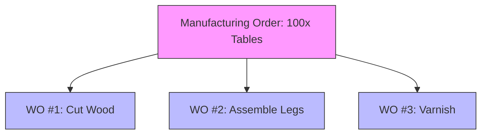

# Understanding Work Orders: Your Production Steps

This guide explains what Work Orders are and how they fit into your manufacturing process. Whether you're a production manager or a shop floor operator, this guide will help you keep track of your work.

---

## What is a Work Order?

Think of a **Manufacturing Order** as a complete recipe (e.g., "Bake a Cake"). A **Work Order** is a single step in that recipe (e.g., "Mix Ingredients", "Bake in Oven", "Decorate").

When you confirm a Manufacturing Order, the system breaks it down into individual Work Orders. Each Work Order represents a specific operation that needs to be done at a specific Work Center.

**Why does this matter?**
1.  **Granular Control**: Track progress step-by-step.
2.  **Resource Management**: Schedule specific machines or stations (Work Centers).
3.  **Cost Accuracy**: Track the actual time spent on each operation to calculate labor and overhead costs precisely.

---

## Relationship to Manufacturing Orders

A Manufacturing Order (MO) is the parent document. It tells you *what* to make and *when*. The Work Orders (WO) are the children; they tell you *how* to make it, step by step.



- **One Manufacturing Order** generates **Multiple Work Orders**.
- You must typically complete Work Orders in sequence (Step 1 → Step 2 → Step 3).

---

## Work Order Lifecycle

A Work Order goes through a specific lifecycle as it moves through your shop floor:

```
Pending ──▶ Ready ──▶ In Progress ──▶ Done
   ⏳         ✅           ⚙️           🎉
```

### ⏳ Pending
- The Work Order is created but cannot start yet.
- Usually waits for a previous step to finish (e.g., you can't "Varnish" before you "Assemble").

### ✅ Ready
- All prerequisites are met.
- Raw materials are available (if applicable).
- The Work Center is ready to take this job.

### ⚙️ In Progress
- Work has started.
- The timer is running (tracking actual duration).
- Components are being consumed.

### 🎉 Done
- The operation is complete.
- The output is ready for the next step or final storage.
- Actual costs are recorded.

> [!NOTE]
> You can also **Cancel** a Work Order if the Manufacturing Order is cancelled or if the production plan changes.

---

## Assigning to Work Centers

Every Work Order is assigned to a **Work Center**. This is the specific location or machine where the work happens (e.g., "Assembly Line 1", "Drill Press A").

- **Capacity Planning**: The system schedules Work Orders based on the Work Center's availability.
- **Costing**: The cost of the Work Order is often calculated based on the Work Center's hourly rate.

> [!TIP]
> See the [Understanding Work Centers](understanding-work-centers.md) guide for more details on configuring your stations.

---

## Time Tracking

Accuracy is key for costing. Each Work Order tracks two types of time:

| Time Type | Description | Why it matters |
|-----------|-------------|----------------|
| **Planned Duration** | How long we *think* it will take. From the Bill of Materials. | Used for scheduling and estimated costs. |
| **Actual Duration** | How long it *actually* took. Recorded by the operator. | Used for actual costing and efficiency reporting. |

**How to track time:**
1.  Click **Start** when you begin the work.
2.  Click **Pause** if you take a break or shift ends.
3.  Click **Done** when the task is finished.

The system will automatically calculate the `Actual Duration`.

---

## Component Consumption

Some Work Orders consume specific components. For example, the "Assembly" step might consume "Screws" and "Wood Panels".

- **Manual Consumption**: You record exactly what you used.
- **Backflushing**: The system automatically "consumes" the expected amount when you click Done.

Ensure you record consumption accurately to keep your inventory levels correct.

---

## Best Practices

### 📅 Sequence Matters
- Follow the sequence defined in the Manufacturing Order. Skipping steps can lead to quality issues or confusion.

### ⏱️ Be Honest with Time
- Record actual start and stop times. If a job takes longer, we need to know why (machine breakdown? bad materials?) to improve future planning.

### 🧹 Keep Work Centers Clear
- Mark a Work Order as "Done" only when the physical items have moved to the next station. This keeps the schedule accurate.

---

## Troubleshooting

### Q: Why is my Work Order stuck in "Pending"?
**A**: This usually means the previous step hasn't finished yet. Check the Manufacturing Order to see the status of preceding Work Orders.

### Q: Can I change the assigned Work Center?
**A**: Yes, if the Work Order hasn't started yet. This is useful for load balancing if one machine is busy.

### Q: Why is my "Actual Cost" higher than expected?
**A**: Check the **Actual Duration**. Did the operator forget to stop the timer? Or did the machine run slower than the **Planned Duration**?

---

## Related Documentation
- [Manufacturing Concepts](manufacturing-concepts.md)
- [Understanding Work Centers](understanding-work-centers.md)
- [Manufacturing Orders](../how-to/manufacturing-orders.md)
