# Debit Notes: Handling Vendor Returns & Corrections

This guide explains how to use Debit Notes to reduce the amount you owe to a vendor (supplier). Whether dealing with goods returns, overcharges, or refunds, Debit Notes ensure your Accounts Payable and expenses are accurate.

---

## What is a Debit Note?

A **Debit Note** is a document that reduces the amount your business owes to a vendor. It is the opposite of a specific Vendor Bill—instead of owing money, you are claiming a reduction in your debt.

**Common reasons to issue a Debit Note:**

| Reason | Example |
|--------|---------|
| **Vendor Returns** | You return 5 damaged hard drives to the supplier |
| **Overcharge Correction** | Vendor billed $100/unit instead of negotiated $90 |
| **Discount Claimed** | Vendor granted a retroactive volume discount |
| **Bill Cancellation** | Duplicate bill being cancelled |
| **Short Shipment** | Invoiced for 10 items but only received 8 |

**Accounting Impact**: A posted Debit Note decreases your expenses/inventory value and reduces Accounts Payable (the amount you owe).

---

## Where to Find It

Navigate to: **Accounting → Adjustment Documents**

When creating a new Adjustment Document, select **Debit Note** as the type.

> [!TIP]
> Debit Notes share the same list as Credit Notes in the "Adjustment Documents" section. Use the filters or distinct badges (Warning/Orange color) to identify them.

---

## Debit Note Workflow

Your debit note goes through these stages:

```mermaid
graph LR
    Draft[📝 Draft] --> Posted[✅ Posted]
    Posted --> Applied[💰 Applied/Refunded]
```



### 📝 Draft
- You can edit all details (vendor, products, amounts).
- No accounting entries generated yet.

### ✅ Posted
- Locked for editing.
- Journal entry created (Debit Accounts Payable, Credit Expense/Asset).
- Reduces the vendor's outstanding balance.

### 💰 Applied / Refunded
- The debit note has been used to pay off another open bill.
- Or the vendor has sent a cash refund.

---

## Creating a Debit Note

### Step 1: Start the Debit Note

1. Go to **Accounting → Adjustment Documents**
2. Click **Create Adjustment Document**
3. Select **Debit Note** as the **Type**.

### Step 2: Fill in the Header

| Field | What to Enter | Example |
|-------|---------------|---------|
| **Type** | Select "Debit Note" | Debit Note |
| **Vendor** | The supplier you are charging back | Tech Supplies Inc. |
| **Currency** | Same as original bill | USD |
| **Date** | Date of the return/correction | Today's date |
| **Original Vendor Bill** | Link to the bill being corrected (optional but recommended) | BILL-2024-889 |
| **Reason** | Why you're issuing this debit | "Return of 5 damaged units" |

### Step 3: Add Line Items

Click **Add Line Item** (or copy from original bill if linked):

| Field | Description | Example |
|-------|-------------|---------|
| **Product** | Item being returned | Hard Drive 1TB |
| **Description** | Details | "Damaged in transit" |
| **Quantity** | Number of items | 5 |
| **Unit Price** | Cost per item | 80.00 |
| **Account** | Expense/Asset account (auto-filled) | Cost of Goods Sold / Inventory |
| **Tax** | Appropriate tax rate | 10% VAT |

> [!NOTE]
> The system handles the "negative" logic automatically. You enter positive numbers, and the "Debit Note" type tells the system to reverse the accounting.

### Step 4: Review and Post

Before clicking **Post**, verify:
- [ ] Correct Vendor is selected.
- [ ] Items and prices match the return/claim.
- [ ] Tax rates match the original bill.

Click **Post** to finalize.

---

## Accounting Behind the Scenes

When you post a Debit Note for a $400 return (plus tax), the system records:

```
┌─────────────────────────────────────────────────────────────┐
│  Dr. Accounts Payable                   $440.00             │
│      Cr. Inventory / Expense                      $400.00   │
│      Cr. Input Tax (Participating)                 $40.00   │
1└─────────────────────────────────────────────────────────────┘
```

**In plain English**: We are reducing our debt to the vendor (Debit AP) and reversing the cost/asset we previously recorded (Credit Expense/Asset).

---

## Applying a Debit Note

Once posted, you can "use" the debit note in two ways:

### Option 1: Allocate to an Open Bill
If you owe this vendor for *other* bills (or the balance of the original bill):
- The Debit Note sits as a "negative debt" on the partner ledger.
- When paying the vendor, you can "match" the Debit Note against an open Bill to reduce the cash payment needed.

### Option 2: Receive a Refund
If the vendor sends you money back (cash/bank transfer):
1. Create a **Payment** (Inbound).
2. Select the Vendor.
3. Link the payment to this Debit Note.

---

## Common Scenarios

### Scenario 1: Returning Goods (RMA)
**Situation**: You bought 50 chairs. 2 arrived broken.
**Action**: Create Debit Note for 2 chairs.
**Result**: Your "Inventory" value drops by the cost of 2 chairs, and you owe the vendor less money.

### Scenario 2: Pricing Error
**Situation**: Vendor invoiced $500 for a service that should be $400.
**Action**: Create Debit Note for $100 (Difference).
**Result**: Reduces expense by $100 and AP by $100.

### Scenario 3: Bill Cancellation
**Situation**: You accidentally posted a duplicate vendor bill.
**Action**: Create a Debit Note for the full amount of the duplicate bill.
**Result**: The duplicate bill and debit note cancel each other out to zero.

---

## Troubleshooting

### "I can't see the Debit Note in Payments"
- Check if the Debit Note is **Posted**. Draft documents don't appear in payment matching.
- Verify the **Currency** matches the payment/bill currency.

### "Tax amount is wrong"
- Ensure you selected the exact same tax rate used on the original Vendor Bill. Differences in tax configuration (e.g., included vs excluded) can cause mismatches.
