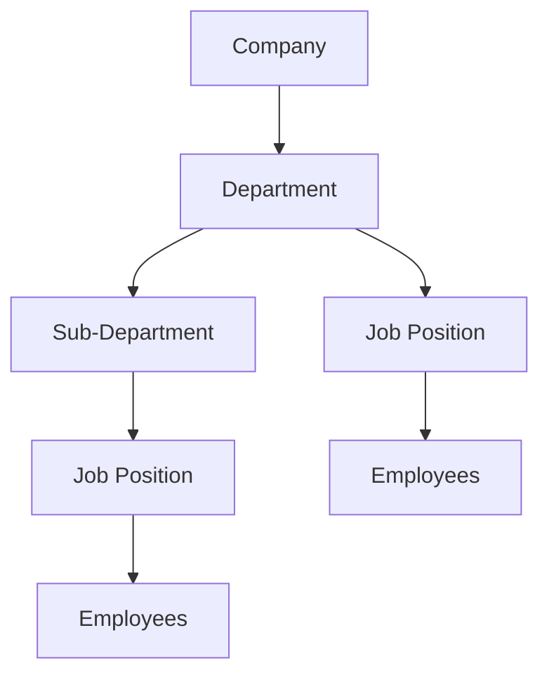

# Organizing Your Workforce: Departments & Positions

This guide explains how to structure your organization in Kezi by setting up Departments and Job Positions. Think of this as building the "skeleton" of your company before adding "flesh" (employees) and "muscles" (contracts).

---

## 1. Understanding the Hierarchy

In Kezi, organizational structure follows a simple flow:

- **Departments**: The broad divisions of your company (e.g., Sales, HR, IT).
- **Sub-Departments**: Smaller teams within a department (e.g., "Field Sales" under "Sales").
- **Job Positions**: The specific roles within those departments (e.g., "Sales Manager", "HR Specialist").

---

## 2. Managing Departments

Departments help you group employees, track costs, and manage approval workflows.

### Creating a Department

Navigate to: **Settings → HR Settings → Departments**

When creating a department, you will find these fields:

| Field | Description | Example |
|-------|-------------|---------|
| **Name** | The official name of the department. | Financial Services |
| **Parent Department** | If this is a sub-unit, select its parent. | Administration |
| **Manager** | The head of this department. | John Doe |
| **Description** | A brief summary of the department's role. | Handles all invoicing and payroll. |
| **Is Active** | Whether the department is currently operational. | Yes |

> [!TIP]
> Setting a **Manager** for a department is crucial because many workflows (like leave approvals) can be configured to stop at the Department Manager first.

---

## 3. Managing Job Positions

Job Positions define the specific roles available in your company. They serve as templates for employee recruitment and contracting.

### Creating a Job Position

Navigate to: **Settings → HR Settings → Job Positions**

#### Basic Information
- **Title**: The formal name of the role (e.g., "Senior Accountant").
- **Department**: Which department this role belongs to.
- **Description**: Overview of the role.
- **Requirements**: Skills or certifications needed (e.g., "CPA certified").
- **Responsibilities**: Key duties of the role.

#### Employment Details
- **Employment Type**: Full-time, Part-time, Contract, or Intern.
- **Level**: The seniority of the role (Entry, Junior, Mid, Senior, Lead, Manager, Director).
- **Is Active**: Non-active positions cannot be assigned to new employees.

#### Salary Range
This section helps HR set expectations for compensation:
- **Currency**: The currency used for the salary range.
- **Min Salary**: The baseline pay for this role.
- **Max Salary**: The upper limit for this role.

---

## 4. Impact on Workflows

Configuring these correctly has a direct impact on other system behaviors:

- **Leave Approvals**: If a department has a **Manager** assigned, the system can use this to route leave requests for initial approval.
- **Employee Setup**: When adding an employee, selecting a **Job Position** automatically links them to the correct department and defines their seniority level.
- **Reporting**: HR analytics often group data by Department to show headcount, turnover, and cost distribution.
- **Contracts**: Position details (like salary range and employment type) serve as a reference when drafting new work contracts.

---

## 5. Best Practices for Configuration

1. **Logical Nesting**: Use parent departments to reflect your actual reporting structure (e.g., Regional Office -> Branch).
2. **Standard Titles**: Use consistent job titles to ensure reporting accuracy across the company.
3. **Manager Assignment**: Always assign a Manager to departments to ensure approval workflows function correctly.
4. **Active Status**: Instead of deleting old roles, mark them as **Inactive** to preserve historical employee data.

---

## 6. Next Steps

Once your departments and positions are set up, you can:
- [Add Employees](employee-management.md) to these positions.
- Connect positions to [Work Contracts](work-contracts.md).
- Use department filters in [HR Reports](analytic-report.md).
