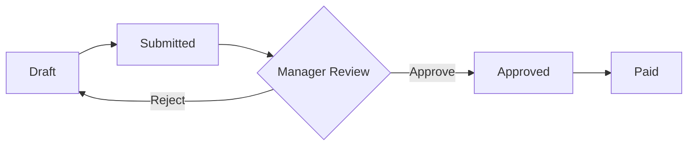

# Expense Reports: Managing Business Expenses

This guide explains how to manage employee expenses, from submission to reimbursement. Whether you're an employee submitting receipts or a manager approving them, this guide covers the entire process.

---

## What is an Expense Report?

An **Expense Report** is a document that groups together all the business-related costs an employee has incurred over a specific period (like a business trip or a month). It acts as a formal request for reimbursement.

**Why do we use them?**
1.  **Reimbursement**: ensures employees get paid back for utilizing personal funds for company business.
2.  **Tracking**: keeps a record of how much the company is spending on travel, meals, and supplies.
3.  **Approval**: allows managers to review costs before money is paid out.

> **💡 Real-World Example**:  
> Imagine you travelled to a client meeting. You paid for a taxi, bought lunch, and stayed in a hotel. You would create *one* Expense Report for "Client Visit - March" and add *three* lines (Taxi, Lunch, Hotel) to it.

---

## Where to Find It

Navigate to: **HR → Expense Reports**

You'll see a list of all your expense reports.
- **Employees** see their own reports.
- **Managers/HR** see reports submitted for their approval.

---

## The Expense Workflow

An expense report goes through these stages:



1.  **Draft**: You are still adding receipts and editing details.
2.  **Submitted**: You've sent it to your manager. You can't edit it anymore.
3.  **Approved**: The manager has accepted the expenses.
4.  **Paid**: Accouting has reimbursed you (via payroll or direct payment).

---

## Creating an Expense Report

### Step 1: Create the Report Header

1.  Go to **HR → Expense Reports**.
2.  Click **Create Expense Report**.
3.  Fill in the basic details:
    *   **Description**: A clear name (e.g., "Dubai Trip - Oct 2023").
    *   **Employee**: Your name (usually auto-filled).
    *   **Date**: The date of submission.

### Step 2: Add Expense Lines

In the **Expense Lines** section, click **Add Item** for each receipt:

| Field | What to Enter |
| :--- | :--- |
| **Description** | What did you buy? (e.g., "Taxi to Airport") |
| **Category** | Choose a category (Travel, Meals, Office Supplies). |
| **Date** | The date on the receipt. |
| **Amount** | The total amount you paid. |
| **Currency** | If you paid in foreign currency (e.g., USD), select it here. |

> **[!TIP]**
> You can drag and drop receipt images into the **Attachments** section of each line strictly for proof!

### Step 3: Submit for Approval

Once you've added all your expenses:
1.  Check the **Total Amount**.
2.  Click **Submit to Manager**.

---

## For Managers: Approving Expenses

When an employee submits a report, you will receive a notification.

1.  Open the **Expense Report**.
2.  Review each line item and the attached receipts.
3.  **Action**:
    *   **Approve**: If everything looks correct.
    *   **Reject**: If expenses are against policy or missing receipts. (You can leave a comment explaining why).

---

## Accounting Impact

When an expense report is **Approved** and **Posted**, the system creates a journal entry:

```
Dr. Travel Expense              $150.00
Dr. Meals Expense               $50.00
    Cr. Employee Payable                $200.00
```

*   **Debit**: Increases the company's expense accounts.
*   **Credit**: Increases the amount the company owes the employee (Liability).

---

## Troublehshooting & FAQ

**Q: I forgot to add a receipt to a submitted report!**
A: Ask your manager to "Refuse" or "Reject" the report. It will go back to **Draft** status, and you can add the missing receipt and submit it again.

**Q: Can I request an advance payment?**
A: No, Expense Reports are for *reimbursement* (money you already spent). For advance money, use the **Cash Advance** feature in the HR module.

**Q: What if I lost a receipt?**
A: Check your company policy. Usually, you need to provide a written explanation or a bank statement screenshot.

---

## Related Documentation

*   [Employee Management](employee-management.md)
*   [Cash Advances](understanding-cash-advances.md)
*   [Policies & Approvals](department-position-config.md)
