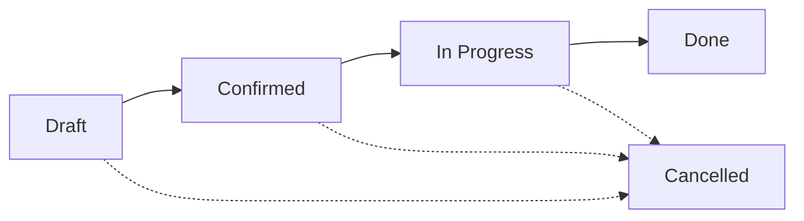

# Manufacturing Orders

## Overview

Manufacturing Orders (MOs) are work orders that instruct your production team to manufacture finished goods from raw materials according to a Bill of Materials (BOM). The system tracks the entire manufacturing lifecycle from planning to completion.

## Manufacturing Order Lifecycle

### Status Definitions

- **Draft**: MO is being planned, can be edited freely
- **Confirmed**: MO is approved and ready to start production
- **In Progress**: Production has started, components are being consumed
- **Done**: Production complete, finished goods received
- **Cancelled**: MO was cancelled before completion

## Creating a Manufacturing Order

### Method 1: From a Bill of Materials
1. Navigate to **Manufacturing** → **Bills of Materials**
2. Open the BOM for the product you want to manufacture
3. Click **Create Manufacturing Order**
4. The system pre-fills the BOM and product

### Method 2: Direct Creation
1. Go to **Manufacturing** → **Manufacturing Orders**
2. Click **New Manufacturing Order**
3. Fill in the required fields

### Required Information

**Product & BOM**
- **Bill of Materials**: Select the BOM to use
- **Product**: Auto-filled from BOM (the finished product)
- **Quantity to Produce**: How many units to manufacture

**Locations**
- **Source Location**: Where raw materials will be taken from
- **Destination Location**: Where finished goods will be placed

**Scheduling**
- **Planned Start Date**: When production should begin
- **Planned End Date**: Expected completion date

**Optional**
- **Notes**: Special instructions for production team
- **Reference**: External reference number (e.g., customer order)

## Manufacturing Order Operations

### Confirming an MO

**When**: After creating and reviewing the MO
**Action**: Click **Confirm** button
**Effect**:
- Status changes to **Confirmed**
- MO number is assigned (if not already)
- Component requirements are reserved
- Cannot be edited anymore

### Starting Production

**When**: Production begins
**Action**: Click **Start Production** button
**Effect**:
- Status changes to **In Progress**
- Actual start date is recorded
- Component consumption can begin

### Completing Production

**When**: All units are manufactured
**Action**: Click **Complete Production** button
**Effect**:
- Status changes to **Done**
- Actual end date is recorded
- Components are consumed from inventory
- Finished goods are received into inventory
- **Accounting entry is created**:
  - DR Finished Goods Inventory
  - CR Raw Materials Inventory

### Cancelling an MO

**When**: MO is no longer needed or was created by mistake
**Action**: Click **Cancel** button (available in Header or Table actions)
**Available**: For **Draft**, **Confirmed**, or **In Progress** status
**Effect**:
- Status changes to **Cancelled**
- **Inventory Cleanup**: All reserved stock for this MO is automatically released (unreserved).
- **Work Orders**: All associated pending or in-progress Work Orders are set to **Cancelled**.
- **Data Integrity**: Cannot be reactivated once cancelled.

**Guardrails**:
- **Consumption Block**: You cannot cancel an MO if any components have already been **consumed** (Done stock moves).
- **Production Block**: You cannot cancel an MO if any finished goods have already been **produced**.
- **Recommendation**: If production has already started and items were moved/consumed, you should complete the order and then use a "Return" or manual inventory adjustment to reverse the impact (to ensure proper audit trails).

## Component Consumption

### Automatic Consumption
When you complete a Manufacturing Order:
1. System calculates required quantities from BOM
2. Components are consumed from the source location
3. Stock moves are created for audit trail
4. Inventory valuation is updated

### Viewing Component Lines
On the MO form, the **Components** tab shows:
- **Product**: Component name
- **Quantity Required**: Based on BOM × MO quantity
- **Quantity Consumed**: Actual consumption (updated on completion)
- **Unit Cost**: Cost per unit of component
- **Total Cost**: Quantity × Unit Cost

## Finished Goods Receipt

### Automatic Receipt
When production completes:
1. Finished goods are received into destination location
2. Quantity produced is recorded
3. Product cost is calculated from component consumption
4. Stock quants are updated

### Quantity Produced
- Normally equals "Quantity to Produce"
- Can be adjusted if actual production differs
- Affects inventory and costing calculations

## Accounting Integration

### Journal Entry Creation
Upon MO completion, the system automatically creates a journal entry:

**Debit**: Finished Goods Inventory Account
- Amount: Total cost of components consumed

**Credit**: Raw Materials Inventory Account  
- Amount: Total cost of components consumed

### Viewing the Journal Entry
1. Open the completed Manufacturing Order
2. Scroll to **Accounting** section
3. Click the linked Journal Entry number
4. Review the accounting impact

### Manufacturing Accounts Setup
**Required Configuration** (Settings → Company):
- Default Finished Goods Inventory Account
- Default Raw Materials Inventory Account
- Default Manufacturing Journal

## Dashboard & Reporting

### Manufacturing Dashboard
Access via **Manufacturing** → **Dashboard**

**Widgets Available**:
- **Pending Orders**: Draft + Confirmed MOs
- **In Production**: Currently active MOs
- **Completed**: Recently finished MOs with completion rate

### Active Manufacturing Orders Widget
Shows real-time view of:
- MO Number
- Product being manufactured
- Quantity to produce vs. produced
- Current status
- Planned start date

## Best Practices

### Planning
- Create MOs in advance to ensure component availability
- Check inventory levels before confirming
- Use realistic planned dates for scheduling

### Production Tracking
- Confirm MOs only when ready to start
- Start production when work actually begins
- Complete promptly to maintain accurate inventory

### Quality Control
- Review component consumption before completing
- Verify finished goods quantity
- Document any variances in notes

### Batch Processing
For multiple similar MOs:
1. Create all MOs in Draft status
2. Review and confirm as a batch
3. Start production in sequence
4. Complete in order to maintain FIFO costing

## Common Scenarios

### Scenario 1: Standard Manufacturing Flow
1. Create MO for 100 Widgets using BOM-WIDGET-001
2. Confirm the MO (reserves components)
3. Start Production (records start time)
4. Complete Production (consumes 200 Steel Plates, 400 Bolts, receives 100 Widgets)
5. System creates accounting entry

### Scenario 2: Partial Production
**Situation**: Planned to make 100 units, only completed 80

**Steps**:
1. Before clicking Complete, adjust "Quantity Produced" to 80
2. Complete the MO
3. Components consumed = BOM qty × 80
4. Only 80 units received into inventory

### Scenario 3: Multi-Stage Manufacturing
**Product**: Complex Assembly

**Approach**:
1. Create MO for sub-assembly A
2. Create MO for sub-assembly B  
3. Complete both sub-assembly MOs
4. Create final MO using sub-assemblies as components
5. Complete final MO

## Troubleshooting

### Cannot Confirm MO
**Issue**: "Insufficient inventory for components"
**Solution**: 
- Check component availability in source location
- Adjust MO quantity or
- Receive more raw materials first

### Components Not Consumed
**Issue**: Completed MO but inventory unchanged
**Solution**:
- Verify MO status is "Done"
- Check component lines show "Quantity Consumed"
- Review stock moves linked to the MO

### Accounting Entry Missing
**Issue**: No journal entry created
**Solution**:
- Verify company manufacturing accounts are configured
- Check MO is fully completed (status = Done)
- Ensure components have unit costs

### Wrong Product Cost
**Issue**: Finished goods cost seems incorrect
**Solution**:
- Review component unit costs
- Check BOM quantities are accurate
- Verify quantity produced matches quantity to produce

## Related Topics
- [Bill of Materials](bill-of-materials.md)
- [Inventory Management](inventory-management.md)
- [Work Centers](work-centers.md)
- [Stock Movements](stock-movements.md)
- [Journal Entries](journal-entries.md)
