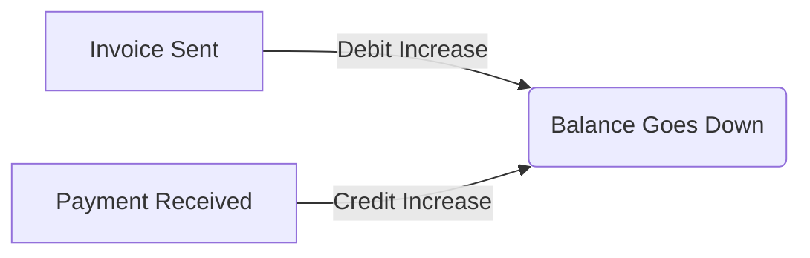
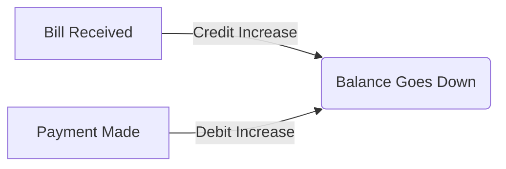

# Partner Ledger Report: Your Partner History

This guide explains how the **Partner Ledger Report** works. Whether you're tracking a customer's payment history or reviewing what you owe a vendor, this report gives you the complete picture.

---

## What is the Partner Ledger?

Think of the Partner Ledger as a detailed **history book** for a specific person or company you do business with. It shows every single transaction between you and them—invoices, bills, payments, and refunds—in chronological order.

**Why does this matter?**
1.  **Dispute Resolution**: If a customer claims they paid an invoice, you can see exactly when and how much was received.
2.  **Reconciliation**: Verify that your records match the statement sent by your vendor.
3.  **Audit Trail**: See the complete story of an account balance, from start to finish.

> [!NOTE]
> Unlike the **Aged Receivables/Payables** reports which only show *unpaid* amounts, the Partner Ledger shows *everything*—including paid invoices and closed transactions.

---

## Where to Find It

Navigate to: **Accounting → Reports → Partner Ledger**

You can also often reach this information from:
- **Partner Profile**: Clicking on the "Ledger" or "History" tab for a specific customer or vendor.

---

## Using the Report

### Step 1: Filter Your View

When you open the report, you'll need to choose what to look at:

| Filter | What to Choose |
|--------|----------------|
| **Partner** | Select the specific Customer or Vendor you want to investigate. |
| **Start Date** | The beginning of the period you're interested in. |
| **End Date** | The end of the period (usually today or month-end). |

> [!TIP]
> If you see `(⚠️ Missing Accounts)` next to a partner's name, it means their profile is missing a Receivable or Payable account. You'll need to fix this in their profile settings before seeing accurate data.

### Step 2: Generate

Click **Generate Report** to load the data.

### Step 3: Understanding the Columns

The report displays a table with these columns:

| Column | Description |
|--------|-------------|
| **Date** | When the transaction occurred. |
| **Reference** | The document number (e.g., Invoice #INV-2024-001). |
| **Transaction Type** | What kind of event it was (Invoice, Bill, Payment, etc.). |
| **Debit** | Increases what a customer owes you (or decreases what you owe a vendor). |
| **Credit** | Decreases what a customer owes you (or increases what you owe a vendor). |
| **Balance** | The running total of the account after this transaction. |

---

## Making Accounting Make Sense

### 🏦 The Flow of Money

Here is how common actions affect the ledger:

**For a Customer (Receivable):**

**For a Vendor (Payable):**

---

## Common Scenarios

### Scenario 1: Proving a Payment

**The situation**: Your vendor, "Tech Supplies Co," says you haven't paid Bill #BILL-999 for $500.

**Here's what you do:**
1.  Open **Partner Ledger**.
2.  Select **Tech Supplies Co**.
3.  Set the date range to cover the bill date until today.
4.  Look for the line with Reference #BILL-999.
5.  Look for a **Payment** transaction shortly after it that reduces the balance.

**Outcome**: You find a payment on Jan 15th for $500. You can export this report and send it to them as proof.

### Scenario 2: Investigating a Balance

**The situation**: A customer's balance is $150, but you thought they were fully paid up.

**Here's what you do:**
1.  Run the report for that customer.
2.  Look at the **Running Balance** column.
3.  Trace it back to find where it stayed positive.
4.  You might find a small $150 invoice from 6 months ago that was missed, or perhaps a partial payment where they short-paid an invoice.

---

## Troubleshooting

### Warning: Missing Accounts

**"Partner Name (⚠️ Missing Accounts)"**
This warning appears in the dropdown selector. It means the system doesn't know which General Ledger accounts to use for this partner.
*   **Fix**: Go to **Partners**, edit this partner, and assign a "Receivable Account" and "Payable Account".

### Balances Don't Match

If the Partner Ledger balance doesn't match the General Ledger:
1.  **Check Date Range**: Ensure you aren't filtering out future transactions that affect the current balance.
2.  **Manual Journal Entries**: Did someone make a manual journal entry against the GL account without tagging the partner? This causes a discrepancy. Always tag the partner in manual entries!

---

## Best Practices

*   **Reconcile Regularly**: Check key vendor ledgers against their statements monthly.
*   **Fix "Missing Accounts"**: Don't ignore the warning icons; incorrect account mapping leads to messy books.
*   **Use References**: Always put the Invoice or Bill number in the reference field so you can cross-reference easily.

---

## Related Documentation

*   [Aged Receivables Report](aged-receivables-report.md) - See only unpaid customer invoices.
*   [Aged Payables Report](aged-payables-report.md) - See only unpaid vendor bills.
*   [General Ledger Report](general-ledger-report.md) - The master record of all accounts.
